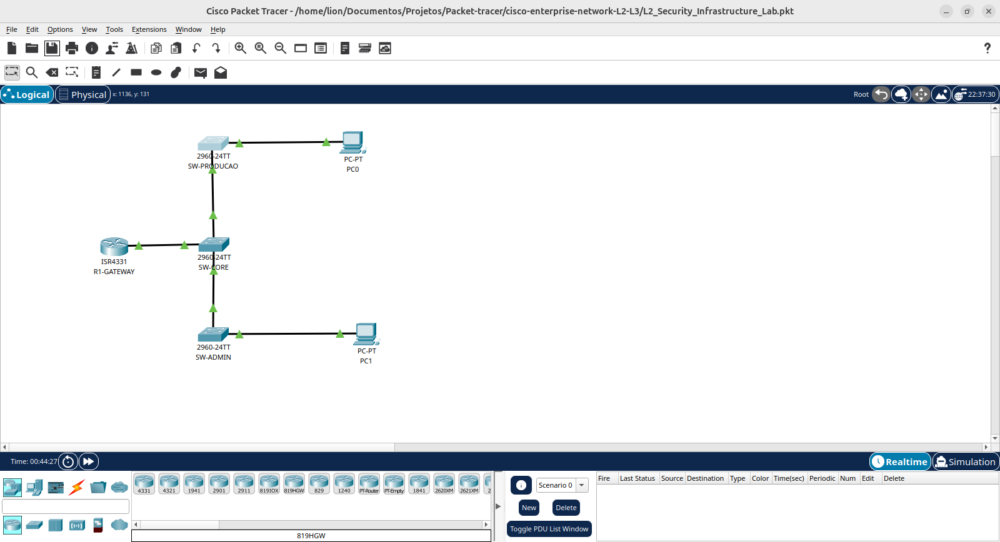
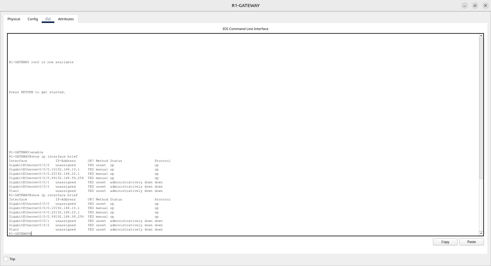
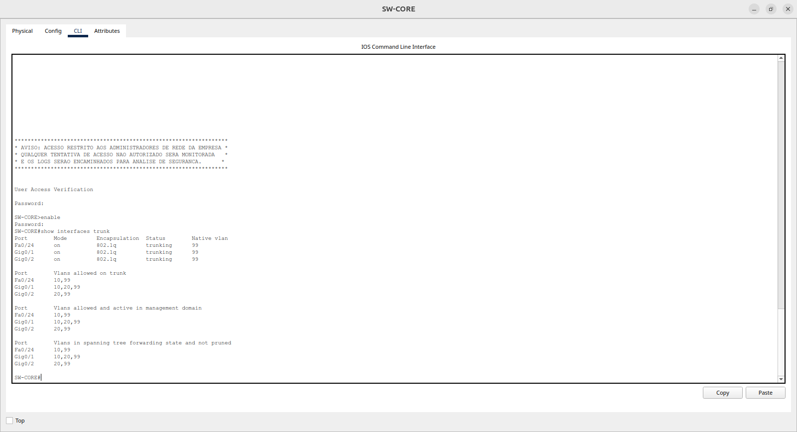
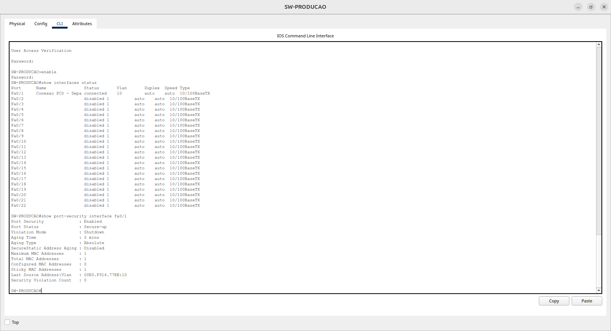
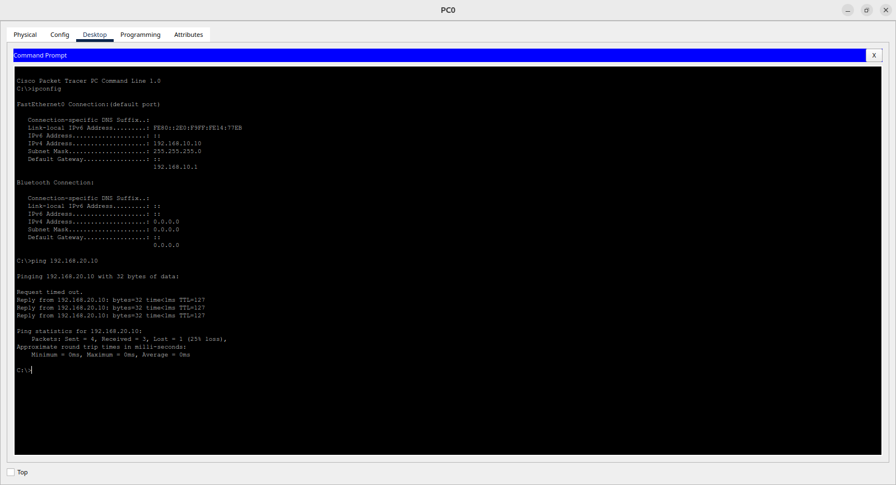

# 🌐 Infraestrutura de Redes Segura L2/L3 - Laboratório Enterprise

Implementação de uma rede corporativa completa simulando um ambiente industrial. O projeto demonstra configurações avançadas de switches e roteadores Cisco, com foco em segurança de Camada 2 e roteamento Inter-VLAN.

<p align="center">
  
</p>

---

## 🔧 Demonstração Técnica e Validação

Nesta seção, apresento a correlação entre a **configuração aplicada (CLI)** e a **evidência de funcionamento (Prints)**.

### 1. Roteamento Inter-VLAN (Router-on-a-Stick)
O roteamento entre os departamentos foi centralizado no ISR 4331.
* **Configuração completa:** [roteador-4331-config.txt](./scripts-configuracao/R1-GATEWAY-config.txt)
* **Comprovação técnica:**
    * 
    * *O print acima confirma as sub-interfaces .10, .20 e .99 em estado UP/UP.*

### 2. Segmentação e Trunking (Core Switch)
O Switch Core gerencia o tráfego de todas as VLANs, utilizando a **VLAN 99 como Nativa** para maior segurança.
* **Configuração completa:** [switch-core-config.txt](./scripts-configuracao/SW-CORE-config.txt)
* **Comprovação técnica:**
    * 
    * *Validação do comando `show interfaces trunk` exibindo a Native VLAN 99 ativa.*

### 3. Segurança de Acesso (Port-Security & STP)
Configuração de Hardening nos switches de acesso para impedir conexões não autorizadas.
* **Scripts de Acesso:** [switch-producao-config.txt](./scripts-configuracao/SW-PRODUCAO-config.txt) | [switch-admin-config.txt](./scripts-configuracao/SW-ADMIN-config.txt)
* **Comprovação técnica:**
    * 
    * *Evidência da porta Fa0/1 em modo `Secure-up` e outras interfaces desativadas.*

### 4. Teste de Conectividade Final (Ping)
Validação de que um host na VLAN 10 (Produção) alcança um host na VLAN 20 (Admin).
* **Documentação de Hosts:** [HOSTS-config.txt](./scripts-configuracao/HOSTS-config.txt)
* **Comprovação técnica:**
    * 
    * *Demonstração do `ipconfig` e `ping` bem-sucedido entre sub-redes distintas.*

---

## 📁 Estrutura do Repositório
```bash
cisco-enterprise-network-L2-L3/
├── evidencias/                      # Capturas de tela para validação (PNG)
│   ├── 01-R1-Subinterfaces-Status.png
│   ├── 02-CORE-Trunk-NativeVLAN99.png
│   ├── 03-ACCESS-Security-VLAN.png
│   └── 04-PC0-Ping-PC1-Success.png
├── scripts-configuracao/            # Scripts CLI comentados (TXT)
│   ├── config-seguranca-e-acesso.txt
│   ├── HOSTS-config.txt
│   ├── R1-GATEWAY-config.txt
│   ├── SW-ADMIN-config.txt
│   ├── SW-CORE-config.txt
│   └── SW-PRODUCAO-config.txt
├── L2_Security_Infrastructure_Lab.pkt # Arquivo do Cisco Packet Tracer
├── README.md                          # Documentação principal
└── topologia-rede-enterprise.png      # Diagrama lógico da topologia
```
### 💡 Desafios e Soluções (Troubleshooting)
Durante a implementação, enfrentei e superei alguns desafios técnicos, o que reforçou minhas habilidades de diagnóstico e resolução de problemas:

**Desafio 1:** Falha de conectividade Inter-VLAN (VLANs no Core).

Problema: O tráfego das VLANs 10 e 20 não transitava entre os switches, impedindo o ping entre departamentos, mesmo com as sub-interfaces do roteador corretamente configuradas com encapsulamento dot1Q e endereçamento IP.

Solução: Identifiquei que as VLANs não haviam sido criadas no banco de dados (vlan.dat) do Switch Core. Embora as portas estivessem atribuídas às VLANs via comando switchport access vlan, o switch não reconhecia essas VLANs porque elas não existiam na configuração. A criação manual das VLANs 10, 20 e 99 no Core usando o comando vlan permitiu que o switch reconhecesse e transportasse os pacotes marcados (tagged) através dos troncos (trunks).

**Desafio 2:** Configuração de Sub-interfaces no Roteador ISR 4331.

Problema: Erro de sintaxe e falha de interface ao tentar configurar o gateway utilizando a nomenclatura padrão GigabitEthernet 0/0.10, comum em modelos anteriores como o Cisco 2911.

Solução: O roteador ISR 4331 exige a nomenclatura de hardware de três dígitos seguindo o padrão slot/subslot/porta. Realizei o ajuste para a nomenclatura interface GigabitEthernet 0/0/0.10 (e demais sub-interfaces .20 e .99), configurando corretamente o encapsulamento dot1Q e os endereçamentos IP para cada gateway departamental. Esta diferença de nomenclatura é importante ao trabalhar com diferentes gerações de equipamentos Cisco.


**Desafio 3:** Interrupção de Comandos por Logs do Sistema.

Problema: Mensagens de log do IOS (notificações de interface %LINK-3-UPDOWN e %LINEPROTO-5-UPDOWN) surgiam no meio da digitação de comandos no CLI, causando confusão visual e erros de digitação durante a configuração.

Solução: Implementei o comando logging synchronous na linha de console (line con 0) de todos os dispositivos. Esse recurso força o IOS a reorganizar a interface de linha de comando quando uma mensagem de log é exibida, movendo o comando em digitação para uma nova linha limpa abaixo da mensagem. Isso melhorou drasticamente a experiência de gerenciamento e reduziu erros de configuração.

**Desafio 4:** Lentidão no Acesso de Dispositivos Finais (STP).

Problema: As estações de trabalho demoravam cerca de 30 a 50 segundos para obter conectividade de rede toda vez que o cabo era conectado ou o dispositivo era ligado. Durante esse período, os PCs não conseguiam obter endereço IP via DHCP nem acessar recursos de rede.

Solução: Identifiquei que o atraso era causado pelo processo de convergência do Spanning Tree Protocol, que passa pelas fases Listening (15s), Learning (15s) e Forwarding antes de permitir tráfego de dados. Como as portas de acesso conectam dispositivos finais (PCs) e não switches, ativei o recurso spanning-tree portfast para ignorar os estados de escuta do STP, reduzindo a convergência para menos de 2 segundos. Para proteger a porta contra loops acidentais caso um switch fosse conectado incorretamente, complementei com spanning-tree bpduguard enable, que desabilita automaticamente a porta ao detectar BPDUs de switches.

***

<div align="center">
 
Estudante de Redes de Computadores | Aprendizado contínuo através de projetos práticos 

[](https://www.linkedin.com/in/jonatas-pimenta-9ab861288/)
[](https://github.com/jonatas-pimenta)

</div>