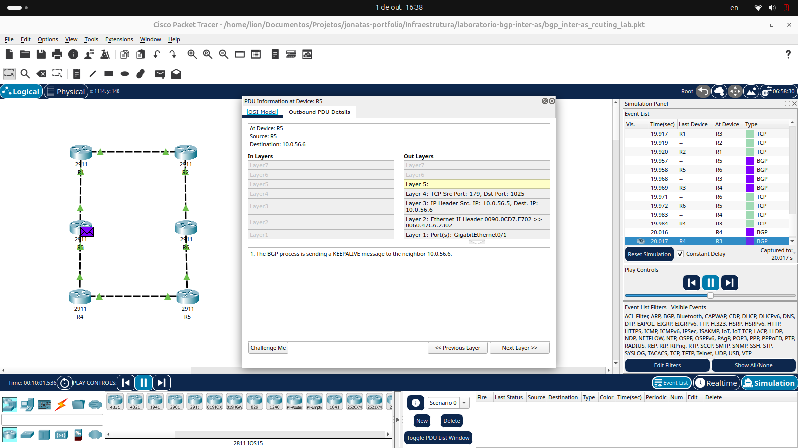

# Laboratório de Roteamento BGP Inter-AS com Múltiplos Sistemas Autônomos

Laboratório avançado de redes implementado no Cisco Packet Tracer, simulando a interconexão de múltiplos Sistemas Autônomos (AS) através do protocolo BGP (Border Gateway Protocol). O projeto demonstra roteamento entre operadoras e provedores de internet, um cenário fundamental para entender o funcionamento da internet global e redes corporativas de larga escala.

Durante a implementação, o projeto enfrentou uma limitação técnica do Packet Tracer que não suporta sessões iBGP. Como solução, a arquitetura foi adaptada para um modelo onde cada roteador opera como um AS independente, utilizando exclusivamente eBGP. Esta adaptação transformou o projeto em um estudo de caso sobre troubleshooting, flexibilidade em design de redes e capacidade de encontrar soluções alternativas diante de restrições técnicas.

## Arquitetura Implementada

A infraestrutura simula um cenário de interconexão entre múltiplos provedores de internet (ISPs) ou operadoras, onde cada Sistema Autônomo precisa trocar informações de roteamento com seus vizinhos para garantir conectividade completa entre todas as redes.

<p align="center">
  
</p>

| Componente                  | Detalhe Técnico                                         | Função Principal                                          |
| :-------------------------- | :------------------------------------------------------ | :-------------------------------------------------------- |
| Plataforma                  | Cisco Packet Tracer 8.2+                                | Simulador de redes avançadas                              |
| Roteadores                  | 6 x Cisco 2911                                          | Equipamentos de borda operando como ASBRs                 |
| Sistemas Autônomos          | AS 65001, 65002, 65003, 65004, 65005, 65006            | 6 AS independentes simulando diferentes operadoras        |
| Protocolo de Roteamento     | eBGP (External BGP)                                     | Troca de informações de roteamento entre AS               |
| Conexões Inter-AS           | 7 links ponto-a-ponto                                   | Interconexões entre diferentes Sistemas Autônomos        |
| Topologia                   | Malha parcial com múltiplos caminhos                    | Redundância e múltiplas rotas para cada destino           |
| Range de IPs                | 10.0.0.0/16 (subnets /24 por link)                     | Endereçamento ponto-a-ponto entre roteadores              |
| Desafio Técnico             | Limitação do Packet Tracer sem suporte a iBGP          | Adaptação arquitetural para modelo eBGP puro              |

## Principais Funcionalidades

- Roteamento BGP Inter-AS: Implementação de sessões eBGP entre 6 Sistemas Autônomos distintos, simulando troca de rotas entre diferentes operadoras.
- Convergência de Rede Completa: Todas as redes alcançam conectividade total através da propagação de rotas BGP entre os AS vizinhos.
- Múltiplos Caminhos: Topologia em malha parcial permitindo redundância e seleção de melhor caminho pelo algoritmo BGP.
- Anúncio de Redes: Cada roteador anuncia suas redes diretamente conectadas para seus vizinhos BGP através do comando network.
- Estabelecimento de Vizinhanças: Configuração manual de peers BGP utilizando comandos neighbor com especificação de AS remoto.
- Tabelas de Roteamento BGP: Análise de rotas aprendidas via BGP e processo de seleção de melhor caminho.
- Troubleshooting e Adaptação: Re-arquitetura do projeto original (planejado com iBGP) para modelo eBGP puro devido a limitações da ferramenta.

## Aplicação Profissional / Valor para Empresas

O protocolo BGP é o alicerce da internet moderna, responsável por rotear o tráfego entre diferentes operadoras, provedores de internet e grandes corporações. Este projeto demonstra compreensão de roteamento avançado em ambientes multi-AS, uma competência essencial para profissionais que trabalham com infraestrutura de ISPs, data centers de larga escala ou redes corporativas multinacionais.

A capacidade de diagnosticar limitações técnicas e adaptar a arquitetura de rede sem comprometer os objetivos de aprendizado reflete habilidades de troubleshooting e pensamento crítico altamente valorizadas no mercado. Em ambientes corporativos reais, profissionais frequentemente precisam ajustar projetos devido a restrições de hardware, software ou orçamento.

O conhecimento de BGP é fundamental para certificações avançadas (CCNP Enterprise, CCNP Service Provider) e para posições de engenharia de redes, arquitetura de infraestrutura e operações de NOC (Network Operations Center) em provedores de serviços.

## Competências Técnicas Demonstradas

- **Border Gateway Protocol (BGP):** Configuração de sessões eBGP, anúncio de redes e estabelecimento de vizinhanças.
- **Sistemas Autônomos:** Compreensão de ASNs (Autonomous System Numbers) e interconexão entre AS diferentes.
- **Roteamento Avançado:** Análise de tabelas BGP, seleção de melhor caminho e propagação de rotas entre AS.
- **Roteadores Cisco:** Configuração de Cisco 2911 e comandos IOS para implementação de BGP.
- **Troubleshooting Avançado:** Identificação de limitações técnicas e adaptação de arquitetura de rede.
- **Design de Redes:** Planejamento de topologias com redundância e múltiplos caminhos.
- **Análise de Conectividade:** Verificação de convergência através de comandos show e testes de ping.
- **Documentação Técnica:** Registro de desafios, soluções implementadas e resultados obtidos.
- **Packet Tracer:** Simulação de cenários complexos e análise de fluxo de pacotes.
- **Flexibilidade Técnica:** Capacidade de adaptar projetos diante de restrições de ferramentas ou plataformas.

## 📁 Estrutura do Projeto

```
bgp-inter-as-lab/
├── README.md
├── bgp_inter-as_routing_lab.pkt
└── print_topologia_bgp.png

```

## 🔧 Demonstração Técnica

### 🎬 Demonstração em Vídeo

<div align="center">
<a href="#" target="_blank">
  
</a>

<p style="margin-top: 12px;">
<em>Veja o BGP em ação: verificação de sessões, tabelas de roteamento e conectividade ponta-a-ponta.</em>
</p>
</div>

**Conteúdo do vídeo:**
- Topologia completa do laboratório explicada
- Verificação das sessões BGP estabelecidas (`show ip bgp summary`)
- Análise da tabela de roteamento do R1 (`show ip route`)
- Teste de conectividade ponta a ponta com `ping`
- Demonstração do fluxo de pacotes com o Modo Simulação

### Topologia Inter-AS com eBGP

A rede foi estruturada com 6 Sistemas Autônomos independentes, cada um operado por um roteador Cisco 2911. As conexões ponto-a-ponto entre os roteadores formam uma topologia em malha parcial, proporcionando múltiplos caminhos e redundância.

| Roteador | Sistema Autônomo | Vizinhos BGP          | Redes Anunciadas           |
| :------- | :--------------- | :-------------------- | :------------------------- |
| R1       | AS 65001         | R2 (AS 65002), R3 (AS 65003) | 10.0.12.0/24, 10.0.13.0/24 |
| R2       | AS 65002         | R1 (AS 65001), R4 (AS 65004) | 10.0.12.0/24, 10.0.24.0/24 |
| R3       | AS 65003         | R1 (AS 65001), R5 (AS 65005) | 10.0.13.0/24, 10.0.35.0/24 |
| R4       | AS 65004         | R2 (AS 65002), R6 (AS 65006) | 10.0.24.0/24, 10.0.46.0/24 |
| R5       | AS 65005         | R3 (AS 65003), R6 (AS 65006) | 10.0.35.0/24, 10.0.56.0/24 |
| R6       | AS 65006         | R4 (AS 65004), R5 (AS 65005) | 10.0.46.0/24, 10.0.56.0/24 |

### Configuração BGP do R1 (AS 65001)

Exemplo de configuração eBGP estabelecendo vizinhanças com dois Sistemas Autônomos diferentes e anunciando as redes diretamente conectadas.

```cisco
router bgp 65001
 neighbor 10.0.12.2 remote-as 65002
 neighbor 10.0.13.3 remote-as 65003
 network 10.0.12.0 mask 255.255.255.0
 network 10.0.13.0 mask 255.255.255.0

```
<div align="center">
 
Estudante de Redes de Computadores | Aprendizado contínuo através de projetos práticos 

[](https://www.linkedin.com/in/jonatas-pimenta-9ab861288/)
[](https://github.com/jonatas-pimenta)

</div>