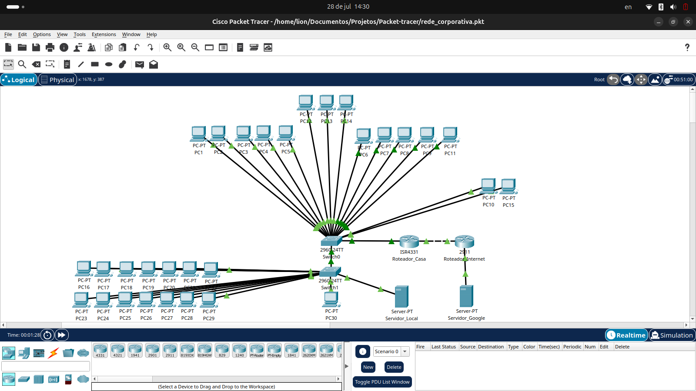

# Laboratório de Rede Corporativa com Segmentação Departamental

Infraestrutura de rede corporativa completa implementada no Cisco Packet Tracer, demonstrando segmentação através de VLANs, roteamento inter-VLAN, políticas de segurança e gerenciamento centralizado de serviços. O projeto simula um ambiente empresarial real com 6 departamentos isolados, controle de acesso à internet por departamento e configurações de rede.

## Arquitetura Implementada

A infraestrutura utiliza conceitos de redes corporativas, incluindo Router-on-a-Stick para roteamento entre VLANs, DHCP centralizado com relay agents, ACLs para controle de tráfego e NAT seletivo para conectividade externa controlada.

<p align="center">
  
</p>

| Componente                  | Detalhe Técnico                                         | Função Principal                                          |
| :-------------------------- | :------------------------------------------------------ | :-------------------------------------------------------- |
| Plataforma                  | Cisco Packet Tracer 8.2+                                | Simulador de redes corporativas                           |
| Segmentação                 | 6 VLANs departamentais (10, 20, 30, 40, 99, 100)       | Isolamento lógico de tráfego por departamento             |
| Roteamento                  | Router-on-a-Stick com 6 sub-interfaces 802.1Q          | Comunicação inter-VLAN                                    |
| DHCP                        | Servidor centralizado (192.168.99.100) com relay        | Atribuição automática de endereços IP                     |
| Conectividade Externa       | NAT Overload (PAT) com ACL seletiva                     | Acesso controlado à internet por departamento             |
| Segurança                   | ACL 101 bloqueando VLAN 30 da WAN                       | Isolamento do departamento de Produção                    |
| Switches                    | Switches Cisco com trunking 802.1Q e VLANs             | Distribuição de rede por departamento                     |
| Spanning Tree               | STP habilitado para prevenção de loops                  | Redundância e estabilidade da rede                        |

## Principais Funcionalidades

- Segmentação Departamental: 6 VLANs isoladas representando diferentes departamentos corporativos (RH, Vendas, Produção, Financeiro, TI e Diretoria).
- Roteamento Inter-VLAN Eficiente: Implementação de Router-on-a-Stick com sub-interfaces configuradas para cada departamento.
- DHCP Centralizado com Relay: Servidor DHCP único gerenciando pools de endereços para todas as VLANs através de DHCP relay agents.
- Políticas de Segurança Granulares: ACL específica bloqueando acesso à internet para o departamento de Produção, mantendo isolamento de redes críticas.
- NAT Seletivo: Access-list controlando quais departamentos podem acessar a WAN, excluindo explicitamente a VLAN 30 (Produção).
- Trunking 802.1Q: Links de trunk configurados entre switches para transporte de múltiplas VLANs.
- Spanning Tree Protocol: Prevenção de loops de switching e otimização de caminhos na rede.
- Simulação de WAN: Conectividade externa simulada com gateway dedicado e NAT Overload.

## Aplicação Profissional / Valor para Empresas

Este projeto demonstra a implementação de uma arquitetura de rede corporativa típica encontrada em empresas de médio porte. A segmentação por VLANs permite isolamento de tráfego entre departamentos, melhorando segurança e performance. A capacidade de aplicar políticas de segurança diferenciadas por departamento é essencial em ambientes corporativos modernos.

As competências demonstradas incluem configuração de equipamentos Cisco, implementação de políticas de acesso, gerenciamento centralizado de serviços de rede e troubleshooting de conectividade. Estas são habilidades fundamentais para profissionais de infraestrutura de TI, administração de redes e segurança corporativa.

A arquitetura é escalável e pode ser expandida para suportar mais departamentos, implementar redundância adicional ou integrar serviços avançados como VoIP, QoS e VPN. O conhecimento aplicado neste projeto é diretamente transferível para certificações Cisco (CCNA) e ambientes de produção reais.

## Competências Técnicas Demonstradas

- **Redes Cisco:** Configuração avançada de roteadores e switches Cisco em ambiente corporativo.
- **VLANs e Trunking:** Implementação de segmentação lógica com VLANs e transporte via trunk 802.1Q.
- **Roteamento Inter-VLAN:** Configuração de Router-on-a-Stick com sub-interfaces e encapsulamento dot1Q.
- **DHCP Enterprise:** Implementação de servidor DHCP centralizado com relay agents (ip helper-address).
- **Access Control Lists (ACLs):** Criação de políticas de segurança para controle granular de tráfego.
- **Network Address Translation:** Configuração de NAT Overload (PAT) com listas de acesso seletivas.
- **Spanning Tree Protocol:** Prevenção de loops de switching e otimização de topologia.
- **Segurança de Rede:** Isolamento de departamentos críticos e aplicação de políticas restritivas.
- **Troubleshooting:** Diagnóstico e resolução de problemas de conectividade em redes corporativas.
- **Documentação Técnica:** Criação de diagramas de rede e documentação de configurações.

## 📁 Estrutura do Projeto
```
network-lab-corporativo/
├── README.md
├── rede_corporativa.pkt
├── print_topologia.png
└── configuracoes/
├── roteador_casa_config.txt
├── roteador_internet_config.txt
├── switch0_config.txt
└── switch1_config.txt
```

## 🔧 Demonstração Técnica

### Segmentação Departamental por VLANs

A rede foi dividida em 6 VLANs representando diferentes departamentos corporativos, cada um com seu próprio segmento de rede e gateway.

<p align="center">
  
</p>

| Departamento | VLAN | Rede              | Gateway         | Dispositivos | Acesso Internet |
| :----------- | :--- | :---------------- | :-------------- | :----------- | :-------------- |
| RH           | 10   | 192.168.10.0/24   | 192.168.10.1    | 5 PCs        | ✅ Permitido   |
| Vendas       | 20   | 192.168.20.0/24   | 192.168.20.1    | 5 PCs        | ✅ Permitido   |
| Produção     | 30   | 192.168.30.0/24   | 192.168.30.1    | 14 PCs       | ❌ Bloqueado   |
| Financeiro   | 40   | 192.168.40.0/24   | 192.168.40.1    | 3 PCs        | ✅ Permitido   |
| TI (MGMT)    | 99   | 192.168.99.0/24   | 192.168.99.1    | 2 PCs        | ✅ Permitido   |
| Diretoria    | 100  | 192.168.100.0/24  | 192.168.100.1   | 1 PC         | ✅ Permitido   |

### Configuração do Router-on-a-Stick

O roteamento entre VLANs foi implementado utilizando a técnica Router-on-a-Stick, onde uma única interface física é dividida em múltiplas sub-interfaces lógicas, cada uma atendendo uma VLAN específica.

```cisco
! Interface principal
interface GigabitEthernet0/0
 no shutdown

! Sub-interface para RH
interface GigabitEthernet0/0.10
 encapsulation dot1Q 10
 ip address 192.168.10.1 255.255.255.0
 ip helper-address 192.168.99.100

! Sub-interface para Produção
interface GigabitEthernet0/0.30
 encapsulation dot1Q 30
 ip address 192.168.30.1 255.255.255.0
 ip helper-address 192.168.99.100
 
 ```
<div align="center">
 
Estudante de Redes de Computadores | Aprendizado contínuo através de projetos práticos 

[](https://www.linkedin.com/in/jonatas-pimenta-9ab861288/)
[](https://github.com/jonatas-pimenta)

</div>