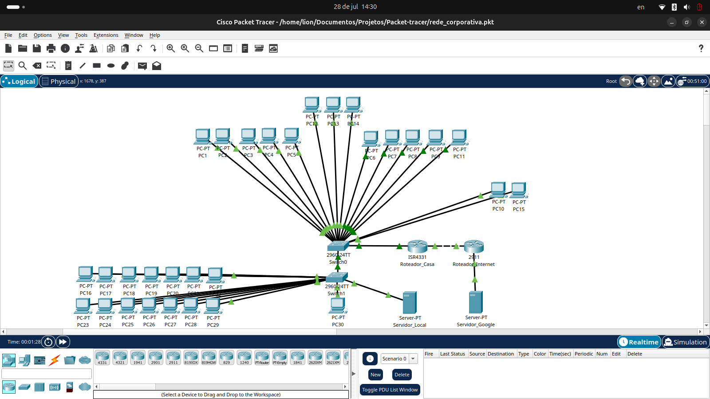

# Laboratório de Rede Corporativa com Cisco Packet Tracer

Implementação de uma infraestrutura de rede corporativa segmentada usando Cisco Packet Tracer, demonstrando boas práticas de segmentação departamental, segurança e conectividade externa em ambiente empresarial.

## Funcionalidades Implementadas

- **Segmentação por Departamentos:** 6 VLANs isolando tráfego (RH, Vendas, Produção, Financeiro, TI, Diretoria)
- **Roteamento Inter-VLAN:** Router-on-a-Stick com 6 sub-interfaces para comunicação controlada
- **DHCP Centralizado:** Servidor único com 6 pools e DHCP Relay (ip helper-address)
- **Políticas de Segurança:** ACL bloqueando departamento específico (Produção) do acesso à internet
- **Conectividade Externa:** WAN simulada com NAT Overload para tradução de endereços
- **Switching Avançado:** VLANs, Trunking 802.1Q e Spanning Tree configurados

## Arquitetura da Rede

<p align="center">
  
</p>

**Segmentação Departamental por VLANs:**

| Departamento | VLAN | Rede              | Gateway         | PCs |
|--------------|------|-------------------|-----------------|-----|
| RH           | 10   | 192.168.10.0/24   | 192.168.10.1    | 5   |
| Vendas       | 20   | 192.168.20.0/24   | 192.168.20.1    | 5   |
| Produção     | 30   | 192.168.30.0/24   | 192.168.30.1    | 14  |
| Financeiro   | 40   | 192.168.40.0/24   | 192.168.40.1    | 3   |
| TI (MGMT)    | 99   | 192.168.99.0/24   | 192.168.99.1    | 2   |
| Diretoria    | 100  | 192.168.100.0/24  | 192.168.100.1   | 1   |

**Características Técnicas:**
- **DHCP Centralizado:** Servidor na VLAN 99 com 6 pools de endereços
- **Router-on-a-Stick:** 6 sub-interfaces com encapsulamento 802.1Q
- **Política de Segurança:** VLAN 30 (Produção) sem acesso à internet via ACL
- **NAT Seletivo:** Apenas departamentos autorizados acessam a WAN

## Tecnologias Demonstradas

- **VLANs e Trunking (802.1Q)** - Segmentação lógica da rede
- **Router-on-a-Stick** - Roteamento inter-VLAN eficiente  
- **DHCP com Relay** - Centralização de serviços de rede
- **Access Control Lists (ACLs)** - Políticas de segurança granulares
- **NAT Overload (PAT)** - Tradução de endereços para internet
- **Spanning Tree Protocol** - Prevenção de loops de switching

## Requisitos

| Ferramenta          | Versão Mínima    |
|---------------------|------------------|
| Cisco Packet Tracer | 8.2.2+          |
| Sistema Operacional | Windows/Linux/macOS |

## Como Executar

1. **Clone o repositório:**
   ```bash
   git clone https://github.com/seu-usuario/network-lab-corporativo.git
   cd network-lab-corporativo
   ```

2. **Abra o projeto:** Execute o arquivo `rede_corporativa.pkt` no Cisco Packet Tracer

3. **Teste a conectividade:**
   - Use o modo de simulação para visualizar o fluxo de pacotes
   - Execute comandos `ping` entre diferentes VLANs
   - Verifique a política de segurança (VLAN 30 bloqueada da internet)

## Estrutura do Projeto

```
network-lab-corporativo/
├── rede_corporativa.pkt         # Arquivo principal do Packet Tracer
├── print_topologia.png          # Diagrama da topologia
├── configuracoes/               # Configurações dos dispositivos
│   ├── roteador_casa_config.txt    # Router-on-a-Stick principal
│   ├── roteador_internet_config.txt # Gateway WAN
│   ├── switch0_config.txt          # Switch com VLANs departamentais
│   └── switch1_config.txt          # Switch secundário
├── SETUP.md                     # Guia de testes detalhado
└── README.md                    # Documentação principal
```

## Demonstração

<details>
<summary><strong>Configuração do Router-on-a-Stick (Clique para expandir)</strong></summary>

```cisco
! Interface principal
interface GigabitEthernet0/0
 no shutdown

! Sub-interfaces por departamento
interface GigabitEthernet0/0.10
 encapsulation dot1Q 10
 ip address 192.168.10.1 255.255.255.0
 ip helper-address 192.168.99.100  ! DHCP Relay

interface GigabitEthernet0/0.30
 encapsulation dot1Q 30
 ip address 192.168.30.1 255.255.255.0
 ip helper-address 192.168.99.100

! ACL - Bloquear Produção da internet
access-list 101 deny ip 192.168.30.0 0.0.0.255 any
access-list 101 permit ip any any

! NAT - Apenas departamentos autorizados
access-list 1 permit 192.168.10.0 0.0.0.255  ! RH
access-list 1 permit 192.168.20.0 0.0.0.255  ! Vendas
access-list 1 permit 192.168.40.0 0.0.0.255  ! Financeiro
access-list 1 permit 192.168.99.0 0.0.0.255  ! TI
access-list 1 permit 192.168.100.0 0.0.0.255 ! Diretoria
! VLAN 30 (Produção) intencionalmente omitida

ip nat inside source list 1 interface GigabitEthernet0/1 overload
```

</details>
