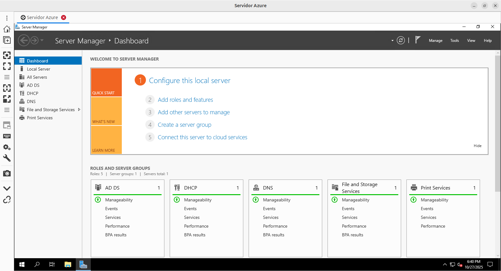
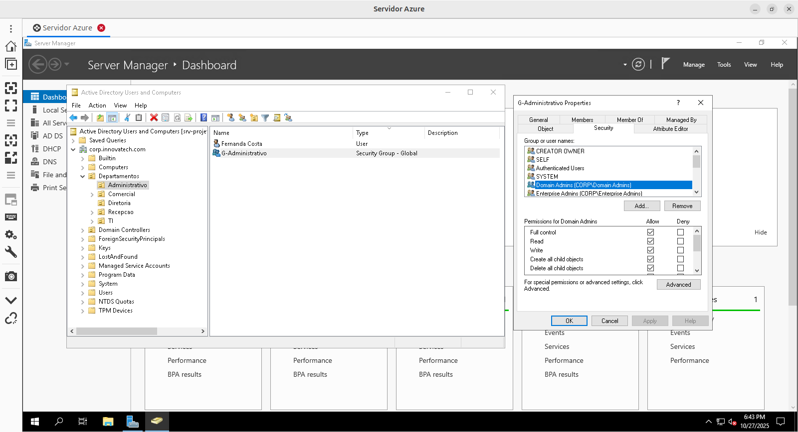
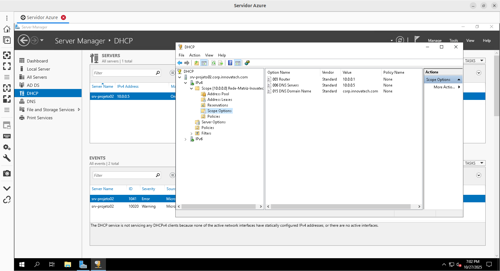
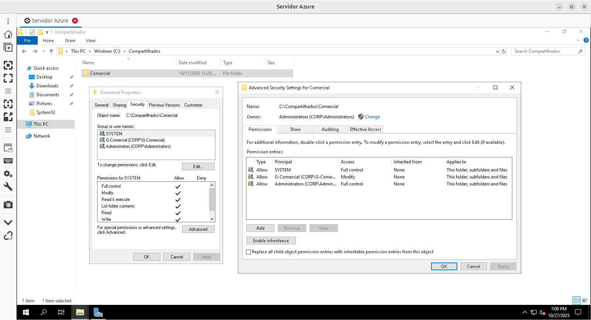
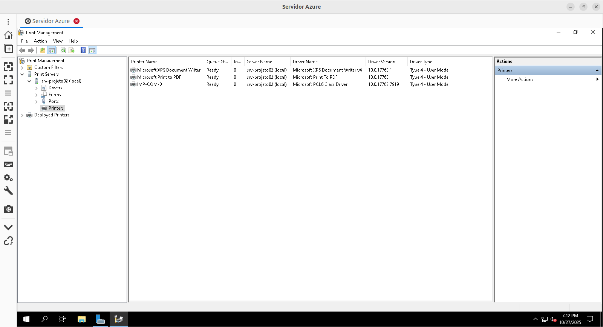
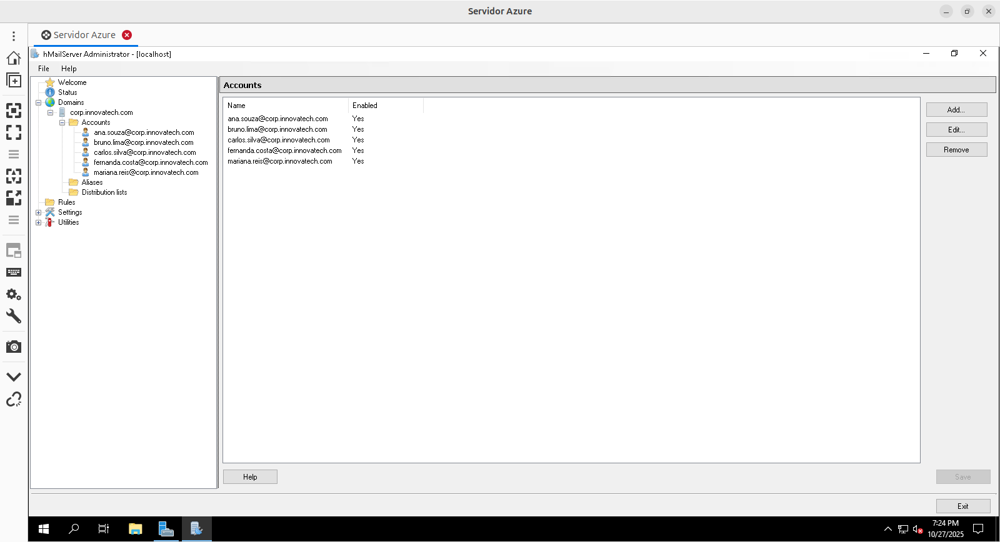
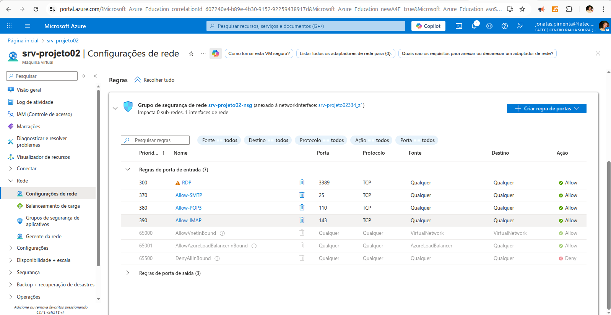

# Implementação de Infraestrutura de Serviços Microsoft Core no Azure

Ambiente de servidor Windows Server 2019 provisionado no Microsoft Azure, configurado como Controlador de Domínio e servidor de infraestrutura centralizado, hospedando serviços essenciais de rede, identidade e colaboração para um cenário corporativo simulado. O projeto demonstra a capacidade de construir e gerenciar uma infraestrutura Microsoft completa em IaaS.

## Arquitetura Implementada

A infraestrutura foi consolidada em uma única Máquina Virtual (VM) no Microsoft Azure, atuando como o servidor central para todos os serviços.

<p align="center">
  
</p>

| Componente                  | Detalhe Técnico                                         | Função Principal                                          |
| :-------------------------- | :------------------------------------------------------ | :-------------------------------------------------------- |
| Plataforma Cloud            | Microsoft Azure                                         | Hospedagem IaaS (Infrastructure as a Service)             |
| Máquina Virtual             | `srv-projeto02` (Standard B2s v2, Win Server 2019)      | Servidor central                                          |
| Rede Virtual (VNet)         | `10.0.0.0/24`                                           | Segmento de rede privado na nuvem                         |
| Servidor (IP Privado)       | `10.0.0.5`                                              | Endereço IP do servidor na VNet                            |
| Domínio AD                  | `corp.innovatech.com`                                   | Gerenciamento centralizado de identidade e autenticação    |
| Serviços Core               | Active Directory DS, DNS (Integrado ao AD), DHCP        | Base da infraestrutura de rede e identidade               |
| Serviços de Usuário         | File Server (SMB), Print Server, Email Server (hMail)   | Recursos compartilhados e colaboração                     |
| Segurança (Firewall)        | Azure Network Security Group (NSG)                      | Controle de acesso de rede (RDP, SMTP, POP3, IMAP)         |

## Principais Funcionalidades

- Gerenciamento Centralizado de Identidade: Autenticação e autorização de usuários através do Active Directory Domain Services.
- Estrutura Organizacional: Implementação de Unidades Organizacionais (OUs) e Grupos de Segurança para gerenciamento granular de permissões por departamento.
- Resolução de Nomes: Serviço DNS integrado ao Active Directory para resolução de nomes interna.
- Atribuição Dinâmica de IPs: Serviço DHCP configurado com escopo, gateway e DNS para clientes da rede.
- Compartilhamento Seguro de Arquivos: File Server com permissões NTFS e de compartilhamento baseadas em grupos do AD.
- Gerenciamento Centralizado de Impressão: Print Server configurado para compartilhamento de impressoras na rede.
- Servidor de Email Interno: Sistema de email funcional (@corp.innovatech.com) com autenticação de usuários via Active Directory.


## Aplicação Profissional / Valor para Empresas

Este projeto simula a espinha dorsal de TI encontrada na maioria das organizações que utilizam o ecossistema Microsoft. A implementação demonstra a capacidade de construir e gerenciar uma infraestrutura de rede coesa, segura e funcional, essencial para operações empresariais, incluindo:

- Segurança e Controle de Acesso: Centralização da autenticação e aplicação de permissões granulares.
- Eficiência Operacional: Automatização de configuração de rede (DHCP) e resolução de nomes (DNS).
- Colaboração e Produtividade: Disponibilização de recursos compartilhados (arquivos, impressoras) e comunicação (email).
- Base para Crescimento: Uma infraestrutura bem configurada é fundamental para a escalabilidade e adoção de novas tecnologias (incluindo serviços de nuvem híbrida).

## Competências Técnicas Demonstradas

- **Cloud Computing (Microsoft Azure):** Provisionamento e gerenciamento de IaaS (VMs, VNets, NSGs).
- **Administração de Windows Server 2019:** Instalação, configuração e gerenciamento de roles e features.
- **Active Directory Domain Services:** Implementação, estruturação (OUs, Grupos) e gerenciamento de identidades.
- **Serviços de Rede Core:** Configuração e administração de DNS e DHCP em ambiente Microsoft.
- **Serviços de Arquivos e Impressão:** Implementação de File Server e Print Server com gerenciamento de permissões.
- **Administração de Email Server:** Instalação e configuração básica de um servidor de email (hMailServer) com integração AD.
- **Segurança de Rede:** Configuração de firewall (NSG) e permissões de acesso (NTFS/Share).
- **Troubleshooting:** Diagnóstico e resolução de problemas de conectividade, performance, dependências de software e restrições de plataforma.
- **PowerShell:** Utilização para automação de tarefas (download de arquivos).

## 📁 Estrutura do Projeto

```
windows-server-azure-lab/
├── README.md
└── prints-azure/
    ├── server-manager-dashboard.png
    ├── aduc_structure.png
    ├── dhcp_scope.png
    ├── fileserver_permissions_advanced.png
    ├── print_management.png
    ├── hmailserver_ad_integration.png
    └── azure_firewall_rules.png
```

## 🔧 Demonstração Técnica

### Estrutura de Unidades Organizacionais (OUs) no Active Directory

A organização do AD foi planejada e implementada para refletir uma estrutura departamental, permitindo gerenciamento granular.

<p align="center">
  
</p>

### Configuração do Escopo DHCP

As opções do escopo DHCP foram definidas para fornecer automaticamente o Gateway e o Servidor DNS corretos aos clientes da rede.

<p align="center">
  
</p>

### Configuração de Permissões NTFS no File Server

As permissões na pasta compartilhada foram cuidadosamente ajustadas, removendo herança e grupos genéricos, para garantir que apenas membros do grupo `G-Comercial` tivessem acesso de modificação.

<p align="center">
  
</p>

### Gerenciamento de Impressão

O serviço de Print Server foi instalado e uma impressora compartilhada (`IMP-COM-01`) foi configurada.

<p align="center">
  
</p>

### Integração hMailServer com Active Directory

O hMailServer foi configurado para autenticar usuários diretamente contra o Active Directory do domínio `CORP`, listando automaticamente as contas existentes.

<p align="center">
  
</p>

### Regras de Firewall no Azure NSG

As regras de entrada no Network Security Group do Azure foram criadas para permitir o tráfego SMTP, POP3 e IMAP para o servidor de e-mail.

<p align="center">
  
</p>

### Download Automatizado de Software via PowerShell

Para otimizar a instalação de software e contornar restrições de segurança do navegador no servidor, utilizei o PowerShell com um `User-Agent` customizado para baixar o instalador do hMailServer, superando um erro 403 Forbidden.

```powershell
# Comando utilizado para baixar o hMailServer, "disfarçando-se" de navegador
Invoke-WebRequest -Uri "https://www.hmailserver.com/download/file/hMailServer-5.6.8-B2574.exe" `
    -OutFile "C:\hMailServer.exe" `
    -UserAgent "Mozilla/5.0 (Windows NT 10.0; Win64; x64) AppleWebKit/537.36 (KHTML, like Gecko) Chrome/58.0.3029.110 Safari/537.36"
```

## 💡 Desafios e Soluções (Troubleshooting)

Durante a implementação, enfrentei e superei alguns desafios técnicos, o que reforçou minhas habilidades de diagnóstico e resolução de problemas:

**Desafio 1: Restrições da Assinatura Azure for Students.**

Problema: A conta apresentou bloqueios para criação de VMs em certas regiões devido a políticas internas ou limitações de capacidade.

Solução: Realizei testes sequenciais em diferentes regiões (Brazil South, West US), identificando Canada Central como uma região funcional e permitida para a assinatura.

**Desafio 2: Lentidão Extrema da VM Inicial e Conexão RDP.**

Problema: A primeira VM criada exibia performance muito baixa, resultando em travamentos na sessão RDP. Posteriormente, a conexão parecia "congelada".

Solução: O diagnóstico inicial sugeriu falta de recursos, levando ao resize da VM para 8GB de RAM. A persistência do problema de "congelamento" foi resolvida ao identificar e corrigir uma configuração incorreta no cliente RDP (Remmina), que estava em modo "View-only".

**Desafio 3: Bloqueio de Download via PowerShell.**

Problema: O download do hMailServer via Invoke-WebRequest foi bloqueado pelo servidor remoto com erro 403 (Forbidden).

Solução: Adaptei o comando PowerShell para incluir um cabeçalho User-Agent que simula um navegador web padrão, conseguindo assim contornar a proteção do site e realizar o download.

**Desafio 4: Falha na Instalação do hMailServer (Dependência).**

Problema: O instalador do hMailServer falhou ao tentar baixar uma dependência (.NET Framework 3.5) de um link antigo (Erro 404).

Solução: Utilizei o Server Manager para instalar o ".NET Framework 3.5 Features" diretamente como um recurso do Windows Server, satisfazendo a dependência antes de executar novamente o instalador do hMailServer.

***

<div align="center">
 
Estudante de Redes de Computadores | Aprendizado contínuo através de projetos práticos 

[](https://www.linkedin.com/in/jonatas-pimenta-9ab861288/)
[](https://github.com/jonatas-pimenta)

</div>