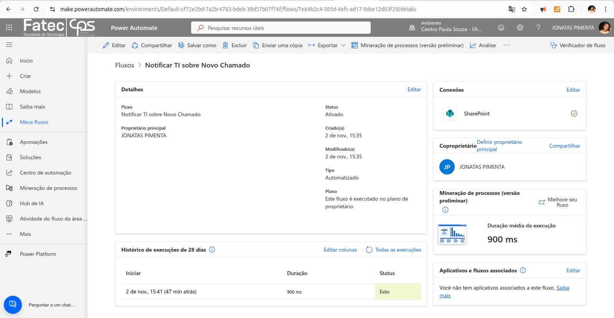
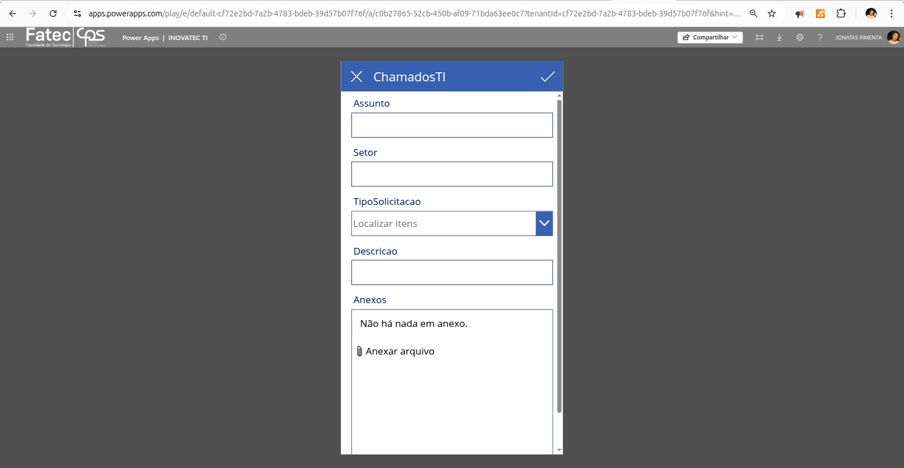
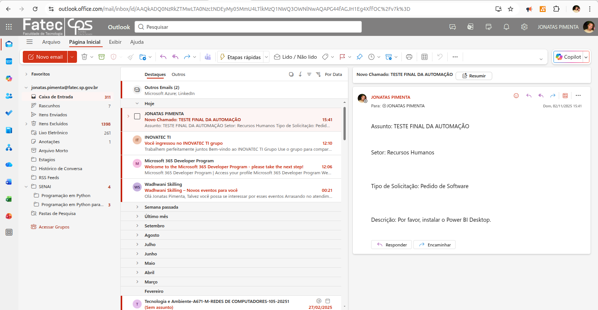
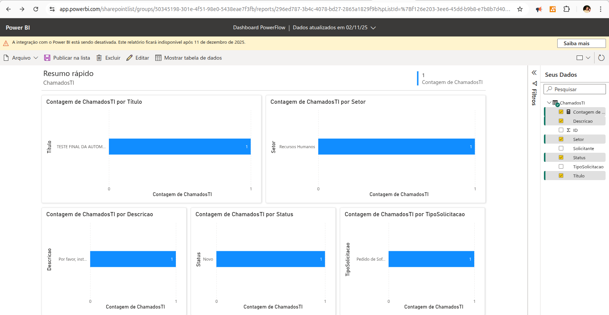

# Automação de Processos de TI (BPA) com Microsoft Power Platform

Implementação de uma solução de digitalização "Low-Code" para automatizar o processo de abertura de chamados de suporte técnico. O projeto utiliza o ecossistema Microsoft Power Platform (Power Apps, Power Automate) integrado ao SharePoint Online e Power BI, simulando um cenário corporativo completo de Business Process Automation (BPA).

## Arquitetura da Solução

A solução integra quatro serviços de nuvem (SaaS) da Microsoft, onde cada um desempenha uma função específica para criar um fluxo de trabalho coeso, desde a entrada de dados do usuário até a análise gerencial.

<p align="center">
  
</p>

| Componente | Detalhe Técnico | Função Principal |
| :--- | :--- | :--- |
| **Plataforma (PaaS)** | Microsoft Power Platform | Orquestração dos serviços de automação e aplicação. |
| **Portal de Entrada** | Power Apps (Canvas App) | **Front-end:** Interface de formulário para o usuário abrir o chamado. |
| **Banco de Dados** | SharePoint Online (List) | **Back-end:** Armazenamento centralizado e estruturado de todos os chamados. |
| **Motor de Automação** | Power Automate (Cloud Flow) | **Cérebro:** Gatilho que detecta novos chamados e executa ações (notificar). |
| **Canal de Notificação** | Outlook (Office 365) | Envio de alertas padronizados para a equipe de suporte. |
| **Camada de Análise** | Power BI (Service) | **Gestão:** Dashboard para visualização de métricas e KPIs dos chamados. |

## Principais Funcionalidades

- **Portal de Entrada Único:** Um aplicativo (Power App) simples e padronizado para o usuário final registrar solicitações de TI.
- **Armazenamento Estruturado:** Todos os chamados são salvos em uma lista central (SharePoint), eliminando planilhas soltas ou e-mails perdidos.
- **Notificação Imediata:** A equipe de TI é notificada automaticamente via e-mail (Outlook) no exato momento em que um novo chamado é criado.
- **Rastreabilidade:** Cada chamado possui um status (`Novo`, `Em Análise`, `Concluído`) e pode ser facilmente rastreado.
- **Análise Gerencial (BI):** Um dashboard (Power BI) conectado em tempo real aos dados permite que gestores analisem métricas como "Chamados por Setor" ou "Principais Tipos de Solicitação".

## Aplicação Profissional / Valor para Empresas

Este projeto é uma demonstração prática de **Digitalização**, uma competência central em grandes corporações como a BASF. Ele prova a capacidade de otimizar operações internas, resultando em:

- **Redução de Custo Operacional:** Automatiza o trabalho manual de triagem e registro de chamados, liberando a equipe de TI para focar em soluções.
- **Aumento de Eficiência:** Padroniza a entrada de dados e acelera o tempo de resposta (SLA), pois a notificação é instantânea.
- **Visibilidade e Tomada de Decisão:** Transforma dados operacionais (chamados) em inteligência de negócio (dashboards), permitindo que gestores identifiquem gargalos ou necessidades recorrentes de treinamento/software.
- **Agilidade (Low-Code):** Demonstra como soluções robustas podem ser criadas em horas ou dias, em vez de meses de desenvolvimento de software tradicional.

## Competências Técnicas Demonstradas

- **Business Process Automation (BPA):** Análise e redesenho de um processo de negócio manual para um fluxo digital automatizado.
- **Desenvolvimento Low-Code/No-Code:** Criação de aplicações funcionais (Power Apps) e fluxos de automação (Power Automate).
- **Integração de Serviços de Nuvem (M365):** Habilidade em conectar múltiplos serviços SaaS (SharePoint, Power Apps, Automate, BI, Outlook) para formar uma solução coesa.
- **Modelagem de Dados Simples:** Estruturação de uma lista no SharePoint (atuando como banco de dados) com tipos de dados corretos.
- **Business Intelligence (BI):** Conexão de uma fonte de dados (SharePoint) ao Power BI Service para criação de relatórios e dashboards.

## 📁 Estrutura do Projeto

```PowerFlow-Automacao-TI/
├── README.md
└── Prints/
    ├── app-formulario.png
    ├── dashboard-powerbi.png
    ├── fluxo-automate.png
    └── notificacao-email.png
```


## 🔧 Demonstração Técnica

### Etapa 1: Portal de Entrada de Dados (Power Apps)

O usuário final utiliza um formulário simples criado no Power Apps para registrar sua solicitação. O aplicativo se conecta diretamente à lista do SharePoint para salvar os dados.

<p align="center">
  
</p>

### Etapa 2: Notificação da Equipe de TI (Automate + Outlook)

Assim que o Power App salva o item, o gatilho "Quando um item for criado" do Power Automate dispara. O fluxo coleta os dados dinâmicos (Assunto, Setor, Descrição) e os formata em um e-mail padronizado, que é enviado à equipe de suporte.

<p align="center">
  
</p>

### Etapa 3: Análise Gerencial (Power BI)

O Power BI Service foi conectado diretamente à lista do SharePoint. O recurso "Visualizar a lista" gera automaticamente um painel de "Resumo Rápido", permitindo a análise imediata dos dados coletados, como a contagem de chamados por setor ou tipo.

<p align="center">
  
</p>

## 💡 Desafios e Soluções (Troubleshooting)

**Desafio 1: Falha na Criação do Ambiente de Desenvolvedor (Sandbox).**

- **Problema:** A tentativa inicial de criar um "Microsoft 365 Developer Program Sandbox" falhou, pois a conta não foi qualificada no momento (um bloqueio comum da Microsoft).
- **Solução:** Foi identificado que a conta acadêmica da Fatec (`@fatec.sp.gov.br`) já possuía as licenças necessárias (Power Apps, Automate, SharePoint) incluídas. O projeto foi pivotado com sucesso para utilizar o ambiente de produção da licença de estudante, sem a necessidade da sandbox.

**Desafio 2: Formulário do Power Apps não exibia campos ("Nenhum item para exibir").**

- **Problema:** Ao testar o aplicativo pela primeira vez, a tela de edição (`EditScreen1`) aparecia em branco, sem os campos do formulário.
- **Solução:** O diagnóstico mostrou que o formulário (`EditForm1`) estava iniciando no modo "Editar" (`EditMode.Edit`) por padrão, mas sem um item selecionado. O fluxo do aplicativo foi corrigido para garantir que o botão `+` na tela principal (`BrowseScreen1`) acionasse a função `NewForm(EditForm1)`, mudando o modo do formulário para "Novo" e exibindo os campos corretamente.

***

<div align="center">
 
Estudante de Redes de Computadores | Aprendizado contínuo através de projetos práticos 

[](https://www.linkedin.com/in/jonatas-pimenta-9ab861288/)
[](https://github.com/jonatas-pimenta)

</div>