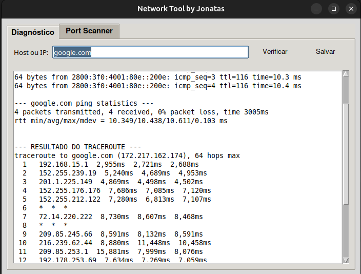
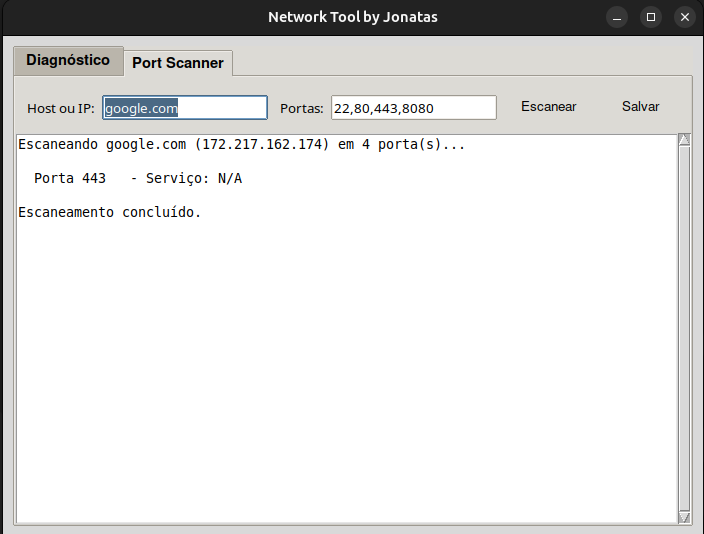

# Ferramenta de Diagnóstico e Análise de Segurança de Rede (Network Tool GUI)

Ferramenta profissional de cibersegurança e diagnóstico de rede com interface gráfica desenvolvida em Python e Tkinter. Implementa funcionalidades essenciais para reconhecimento de infraestrutura, análise de vulnerabilidades e testes de penetração, proporcionando uma solução integrada para profissionais de segurança e administradores de rede.

## Arquitetura Implementada

A aplicação foi desenvolvida seguindo uma arquitetura modular com separação clara entre interface gráfica, lógica de negócio e módulos especializados de segurança.

<p align="center">
  
</p>

| Componente | Detalhe Técnico | Função Principal |
| :--- | :--- | :--- |
| **Plataforma** | Python 3.6+ com Tkinter | Desenvolvimento multiplataforma (Windows, Linux, macOS) |
| **Interface (GUI)** | Tkinter com TTK themes | Interface responsiva em abas para organização de funcionalidades |
| **Motor de Diagnóstico** | Módulo backend.py | Execução de comandos de rede (ping, traceroute, nslookup) |
| **Scanner de Portas** | Módulo scanner.py com threading | Escaneamento multi-threaded eficiente de portas TCP |
| **Conectividade** | Python sockets | Estabelecimento de conexões TCP para detecção de serviços |
| **Processamento Paralelo** | Threading | Operações não-bloqueantes mantendo interface responsiva |
| **Persistência** | Arquivos de saída com timestamp | Exportação de resultados para documentação e relatórios |

## Principais Funcionalidades

**Módulo de Diagnóstico de Rede**
- Ping: Verificação de conectividade e medição de latência com hosts remotos
- Traceroute: Mapeamento de rota de rede até o destino para análise de infraestrutura
- NSLookup: Consultas DNS com saída filtrada e formatada para análise
- Exportação: Salvamento automático de resultados com timestamp para documentação

**Scanner de Portas TCP**
- Multi-threading: Escaneamento rápido e eficiente de múltiplas portas simultâneas
- Flexibilidade: Suporte para portas específicas ou intervalos (ex: 80,443,1000-2000)
- Banner Grabbing: Identificação de serviços e versões rodando nas portas abertas
- Progresso Visual: Barra de progresso em tempo real durante o escaneamento
- Relatórios: Exportação estruturada de descobertas para análise

**Interface e Usabilidade**
- Interface em Abas: Navegação organizada entre diferentes módulos de análise
- Responsividade: Threads separadas garantem interface fluida durante operações
- Validação de Entrada: Verificação de parâmetros antes da execução de ferramentas
- Tratamento de Erros: Mensagens informativas e recuperação graceful
- Design Profissional: Interface moderna com temas TTK consistente

## � Estrutura do Projeto

```
network-tool-gui/
├── app.py              # Interface gráfica principal (Tkinter)
├── backend.py          # Módulo de comandos de diagnóstico
├── scanner.py          # Módulo de escaneamento de portas
├── requirements.txt    # Dependências do projeto
├── README.md          # Documentação
├── screenshots/
│   ├── screenshot_diagnostico.png
│   └── screenshot_scanner.png
└── LICENSE            # Licença MIT
```

## 🔧 Demonstração Técnica

### Interface Principal com Módulos Organizados

A aplicação implementa uma interface baseada em abas (Notebook) que organiza logicamente os diferentes módulos de análise, permitindo navegação rápida entre funcionalidades.

<div align="center">
  
  <span>&nbsp;&nbsp;</span>
  
</div>

### Módulo de Diagnóstico de Rede

O módulo de diagnóstico integra ferramentas clássicas de redes através de execução de comandos do SO via subprocess:

```python
# Exemplo de integração do comando ping
def run_ping(target, count=4):
    """Executa ping e retorna resultado formatado"""
    try:
        result = subprocess.run(
            ['ping', '-c', str(count), target],
            capture_output=True,
            text=True,
            timeout=10
        )
        return result.stdout
    except subprocess.TimeoutExpired:
        return "Erro: Timeout na execução do ping"
```

### Scanner de Portas com Multi-threading

O scanner implementa escaneamento paralelo para eficiência, testando múltiplas portas simultaneamente e coletando informações de banner:

```python
# Escaneamento eficiente com threading
def scan_port(host, port, results_list):
    """Testa uma única porta em thread separada"""
    try:
        with socket.socket(socket.AF_INET, socket.SOCK_STREAM) as sock:
            sock.settimeout(2)
            result = sock.connect_ex((host, port))
            if result == 0:
                results_list.append(f"Porta {port}: Aberta")
            else:
                results_list.append(f"Porta {port}: Fechada")
    except socket.error as e:
        results_list.append(f"Porta {port}: Erro - {str(e)}")
```

## 💡 Desafios e Soluções (Troubleshooting)

**Desafio 1: Interface Não Responsiva Durante Escaneamento Longo**

- **Problema:** Quando o scanner de portas executava, a interface congelava porque as operações de I/O bloqueavam a thread principal.
- **Solução:** Implementação de threading separado para cada operação, garantindo que a GUI sempre permaneça responsiva. A thread de trabalho atualiza a interface através de callbacks thread-safe.

**Desafio 2: Compatibilidade de Comandos Entre Sistemas Operacionais**

- **Problema:** Comandos como `ping` e `traceroute` têm sintaxes diferentes entre Windows e Linux/macOS.
- **Solução:** Implementação de detecção de SO via `sys.platform` e execução condicional de comandos apropriados para cada plataforma.

**Desafio 3: Timeout em Escaneamento de Portas com Muitas Portas**

- **Problema:** Testar intervalos grandes (ex: 1-65535) levava muito tempo ou causava overhead de threads.
- **Solução:** Limitação de threads simultâneas com um thread pool, permitindo que o usuário customize o número de workers e o timeout por porta para balancear velocidade e precisão.

## ⚡ Instalação e Execução

### Execução Rápida

```bash
# Clone o repositório
git clone https://github.com/jonatas-pimenta/jonatas-portfolio.git

# Navegue até o projeto
cd jonatas-portfolio/ciberseguranca/network-tool-gui

# Execute a aplicação
python3 app.py
```

### Instalação no Linux

```bash
# Ubuntu/Debian - Instalar tkinter (se necessário)
sudo apt-get update
sudo apt-get install python3-tk

# Fedora/CentOS
sudo yum install tkinter

# Arch Linux
sudo pacman -S tk
```

## Casos de Uso em Cibersegurança

**Reconnaissance (Reconhecimento)**
- Identificação de hosts ativos na rede
- Mapeamento de infraestrutura de rede
- Descoberta de serviços expostos

**Análise de Vulnerabilidades**
- Identificação de portas abertas desnecessárias
- Detecção de serviços com versões desatualizadas
- Avaliação da superfície de ataque

**Documentação de Pentest**
- Geração de relatórios com timestamps
- Documentação de descobertas
- Evidências para relatórios de segurança


---

<div align="center">
 
Estudante de Redes de Computadores | Aprendizado contínuo através de projetos práticos 

[](https://www.linkedin.com/in/jonatas-pimenta-9ab861288/)
[](https://github.com/jonatas-pimenta)

</div>