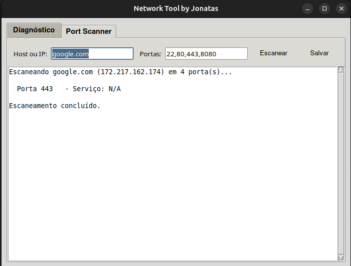

# Network Tool GUI 🔧🔍

[](https://www.python.org/)
[](https://docs.python.org/3/library/tkinter.html)
[](LICENSE)

> **Ferramenta de cibersegurança e diagnóstico de rede** com interface gráfica desenvolvida em Python e Tkinter. Projetada para profissionais de segurança e administradores de rede para tarefas de reconnaissance, diagnóstico e análise de segurança.

## 🎯 Funcionalidades de Segurança

### 🌐 **Módulo de Diagnóstico de Rede**
- **🏓 Ping**: Verifica conectividade e latência com hosts remotos
- **🗺️ Traceroute**: Mapeia a rota de rede até o destino (útil para análise de infraestrutura)
- **🔍 NSLookup**: Consultas DNS com saída filtrada e limpa
- **💾 Exportação**: Salva resultados com timestamp para documentação de testes

### 🔓 **Scanner de Portas TCP**
- **⚡ Multi-threading**: Escaneamento rápido e eficiente de múltiplas portas
- **🎯 Flexibilidade**: Suporta portas específicas ou intervalos (ex: `80,443,1000-2000`)
- **🏷️ Banner Grabbing**: Identifica serviços rodando em portas abertas
- **📊 Progresso Visual**: Barra de progresso em tempo real
- **📋 Relatórios**: Exportação de resultados para análise posterior

### 🎨 **Interface e Usabilidade**
- **📑 Interface em Abas**: Navegação organizada entre funcionalidades
- **🔄 Threads Separadas**: Interface responsiva durante operações longas
- **✅ Validação**: Verificação de entrada antes da execução
- **⚠️ Tratamento de Erros**: Mensagens claras e informativas
- **🎨 Design Moderno**: Interface profissional com temas TTK

## 📸 Screenshots

<div align="center">
  
  <span>&nbsp;&nbsp;</span>
  
</div>

## 🔧 Tecnologias Utilizadas

- **🐍 Python 3.6+**: Linguagem principal
- **🖥️ Tkinter**: Interface gráfica nativa
- **🧵 Threading**: Processamento paralelo
- **🌐 Socket**: Conectividade de rede
- **⚙️ Subprocess**: Execução de comandos do sistema

## ⚡ Instalação e Execução

### 🚀 Execução Rápida

```bash
# Clone o repositório
git clone https://github.com/jonatas-pimenta/jonatas-portfolio.git

# Navegue até o projeto
cd jonatas-portfolio/ciberseguranca/network-tool-gui

# Execute a aplicação
python3 app.py
```

### 🐧 Instalação no Linux

```bash
# Ubuntu/Debian - Instalar tkinter (se necessário)
sudo apt-get update
sudo apt-get install python3-tk

# Fedora/CentOS
sudo yum install tkinter

# Arch Linux
sudo pacman -S tk
```

### 🪟 Windows

```bash
# O Tkinter já vem incluído com o Python no Windows
python app.py
```

## 📁 Estrutura do Projeto

```
network-tool-gui/
├── 📄 app.py              # Interface gráfica principal (Tkinter)
├── 🔧 backend.py          # Módulo de comandos de diagnóstico
├── 🔍 scanner.py          # Módulo de escaneamento de portas
├── 📋 requirements.txt    # Dependências do projeto
├── 📖 README.md          # Documentação
├── 🖼️ screenshot_*.png    # Capturas de tela
└── 📄 LICENSE            # Licença MIT
```

## 🎯 Casos de Uso em Cibersegurança

### 🔍 **Reconnaissance (Reconhecimento)**
- Identificação de hosts ativos na rede
- Mapeamento de infraestrutura de rede
- Descoberta de serviços expostos

### 🛡️ **Análise de Vulnerabilidades**
- Identificação de portas abertas desnecessárias
- Detecção de serviços com versões desatualizadas
- Avaliação da superfície de ataque

### 📊 **Documentação de Pentest**
- Geração de relatórios com timestamps
- Documentação de descobertas
- Evidências para relatórios de segurança

## ⚡ Exemplos de Uso

### Scanner de Portas
```
Host: 192.168.1.1
Portas: 22,80,443,8080,3389
```

### Diagnóstico de Rede
```
Host: google.com
Executará: ping, traceroute, nslookup
```

## 🤝 Contribuição

Contribuições são bem-vindas! Sinta-se à vontade para:

1. 🍴 Fazer um fork do projeto
2. 🌟 Criar uma branch para sua feature
3. 💻 Implementar melhorias
4. 📤 Enviar um pull request

## 📄 Licença

Este projeto está licenciado sob a **MIT License** - veja o arquivo [LICENSE](LICENSE) para detalhes.

## 👨‍💻 Autor

**Jonatas Pimenta**
- 🌐 Portfolio: [jonatas-portfolio](https://github.com/jonatas-pimenta/jonatas-portfolio)
- 💼 LinkedIn: [Seu LinkedIn]
- 📧 Email: [seu.email@exemplo.com]

---

<div align="center">

### 🔒 **Ferramenta para Profissionais de Cibersegurança**

*Use com responsabilidade e apenas em redes autorizadas*

</div>