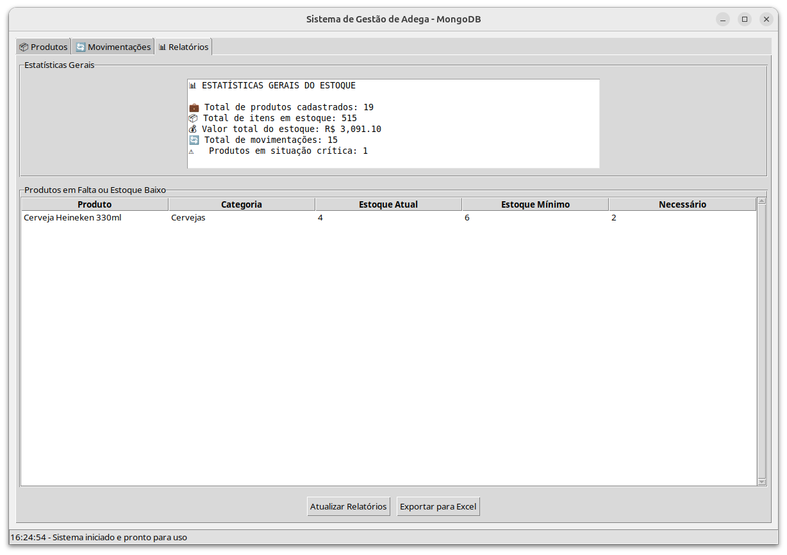
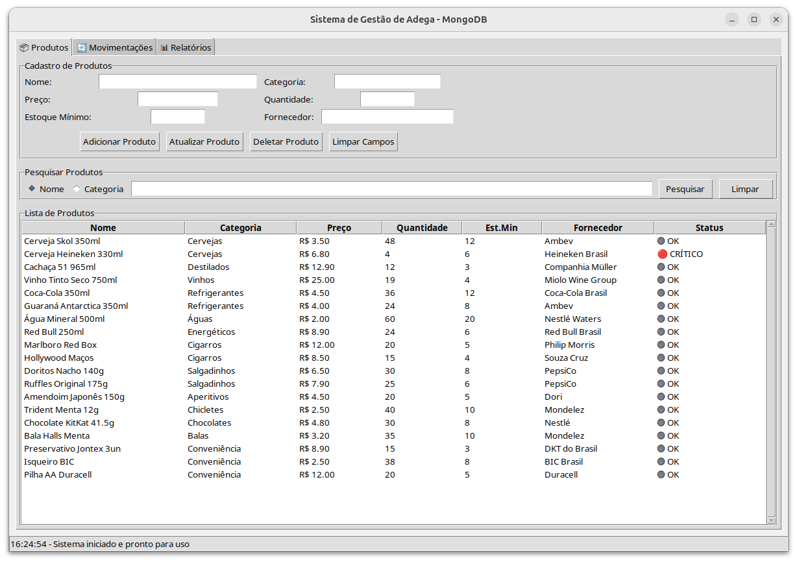

#  StockFlow – Fluxo Inteligente de Estoques "🐍+📦"

<div align="center">


**StockFlow – Fluxo Inteligente de Estoques, com interface gráfica, integração MongoDB e geração de relatórios.**

[🚀 Instalação](#-como-executar) • [💼 Funcionalidades](#-funcionalidades) • [🎯 Arquitetura](#-arquitetura-do-sistema) • [🤝 Contato](#-contato-e-portfólio)

</div>

---

## 📋 Descrição do Projeto

O **StockFlow – Fluxo Inteligente de Estoques** é uma aplicação desktop desenvolvida em Python, com interface gráfica Tkinter e banco de dados MongoDB. Permite o cadastro, consulta, movimentação e controle de produtos, além da geração de relatórios detalhados e exportação para Excel.

O projeto foi desenvolvido para facilitar a gestão de estoques em pequenas empresas, com foco em usabilidade, praticidade e integração de dados.

---

## 🏗️ Arquitetura do Sistema

```
┌──────────────────────────────┐
│        Interface GUI         │
│         (Tkinter)            │
├──────────────────────────────┤
│  Cadastro e consulta         │
│  Movimentação de estoque     │
│  Geração de relatórios       │
└─────────────┬────────────────┘
              │
              ▼
┌──────────────────────────────┐
│        Banco de Dados        │
│          (MongoDB)           │
├──────────────────────────────┤
│  Coleção de produtos         │
│  Histórico de movimentações  │
└──────────────────────────────┘
              │
              ▼
┌──────────────────────────────┐
│      Relatórios/Exportação   │
│         (Pandas, Excel)      │
└──────────────────────────────┘
```

---

## 💼 Funcionalidades

- **Cadastro de produtos** com campos essenciais (nome, tipo, quantidade, preço, etc)
- **Consulta e busca** de produtos por nome, tipo ou código
- **Movimentação de estoque** (entrada e saída)
- **Histórico de movimentações** detalhado
- **Geração de relatórios** filtrados por período, produto ou tipo
- **Exportação para Excel** dos relatórios (usando Pandas/OpenPyXL)
- **Interface gráfica intuitiva** com abas para cada funcionalidade

---

## 📋 Pré-requisitos

- **Python 3.12+**
- **MongoDB 4.4+** (local ou remoto)
- **Tkinter** (nativo do Python)
- **Pandas** (`pip install pandas`)
- **pymongo** (`pip install pymongo`)
- **openpyxl** (`pip install openpyxl`) *(se exportar para Excel)*

---

## 🚀 Como Executar

Recomenda-se usar o script de execução fornecido (cuida de criar venv, instalar deps e iniciar o MongoDB quando possível).

Torne o script executável (uma só vez):
```bash
cd /home/lion/Documentos/Projetos/jonatas-portfolio/dev/StockFlow
chmod +x executar.sh
```

Execute o sistema:
```bash
./executar.sh
```

Observações:
- O script cria/usa um virtualenv em ./venv e executa o arquivo main.py.
- Se preferir, pode executar diretamente com o Python do venv:
  ```bash
  . ./venv/bin/activate
  python3 main.py
  ```
- Se o MongoDB não estiver rodando localmente, inicie com:
  ```bash
  sudo systemctl start mongod
  ```

## 📸 Screenshots

<!-- SCREENSHOTS-START -->
<p align="center">
  <br>
  <em>Relatórios — estatísticas gerais e lista de produtos com estoque baixo</em>
</p>

<p align="center">
  <br>
  <em>Produtos — formulário de cadastro/edição e lista de produtos</em>
</p>

<p align="center">
  <br>
  <em>Movimentações — registrar entrada/saída e histórico</em>
</p>
<!-- SCREENSHOTS-END -->

---


## 📁 Estrutura do Projeto

```text
StockFlow/
├── main.py             # Arquivo principal da interface
├── db.py               # Módulo de integração com MongoDB
├── executar.sh         # Script para criar/ativar venv e iniciar o app
├── requirements.txt    # Dependências do projeto
├── .gitignore          # Arquivos/pastas ignorados no git
└── __pycache__/        # Cache do Python (não versionado)
```
---

## 🔧 Demonstração Técnica

### Exemplo de integração com MongoDB
```python
from pymongo import MongoClient

client = MongoClient("mongodb://localhost:27017/")
db = client["adega"]
produtos = db["produtos"]

# Inserir produto
produtos.insert_one({"nome": "Vinho Tinto", "quantidade": 10})

# Buscar produto
for produto in produtos.find({"nome": "Vinho Tinto"}):
    print(produto)
```

### Exportação de relatório para Excel
```python
import pandas as pd

dados = list(produtos.find())
df = pd.DataFrame(dados)
df.to_excel("relatorio_estoque.xlsx", index=False)
```

---

## 🔍 Conceitos Demonstrados

- **Integração Python + MongoDB** para armazenamento flexível de dados
- **Desenvolvimento de GUI** com Tkinter
- **Manipulação de dados** e geração de relatórios com Pandas
- **Exportação para Excel** com OpenPyXL
- **Boas práticas de organização de código e versionamento**

---

## 💼 Valor para Recrutadores

- **Automação de processos de estoque**
- **Integração de banco de dados NoSQL**
- **Desenvolvimento de aplicações desktop**
- **Geração de relatórios e exportação de dados**
- **Organização e documentação profissional**

---

<div align="center">
 
Estudante de Redes de Computadores | Aprendizado contínuo através de projetos práticos 

[](https://www.linkedin.com/in/jonatas-pimenta-9ab861288/)
[](https://github.com/jonatas-pimenta)

</div>
