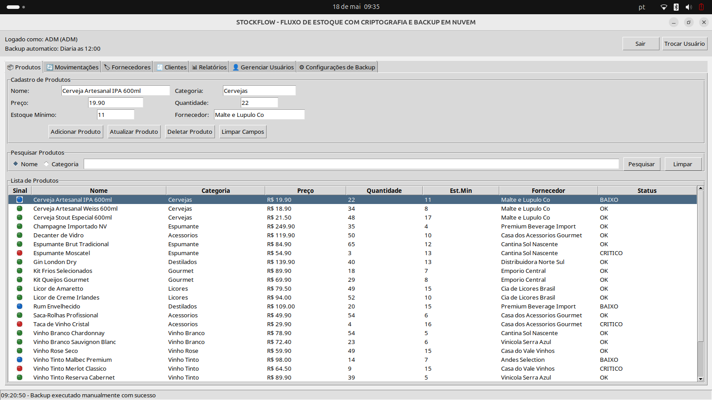
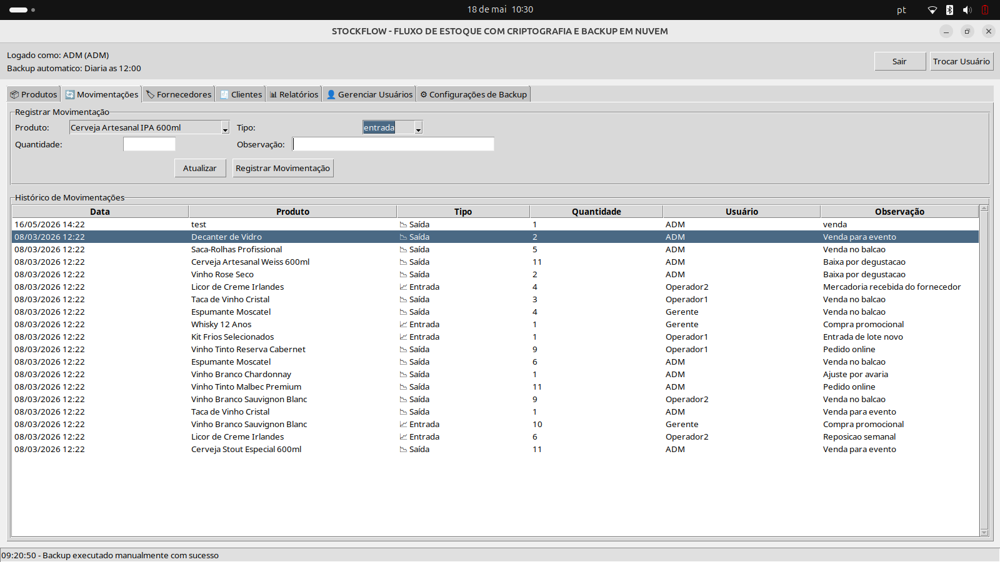
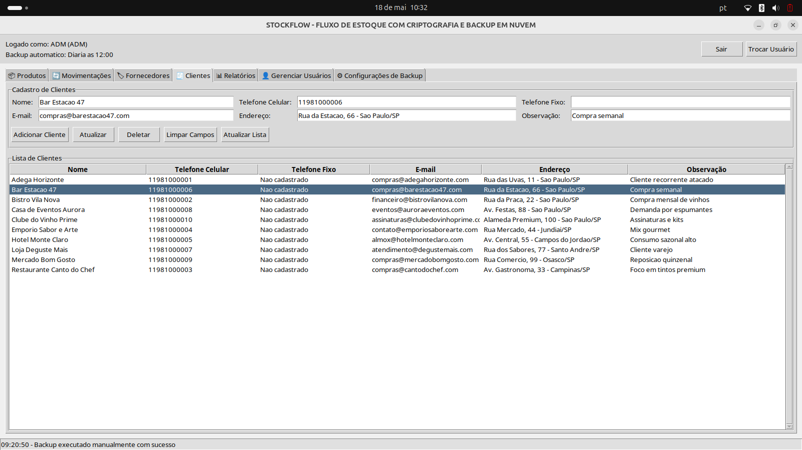
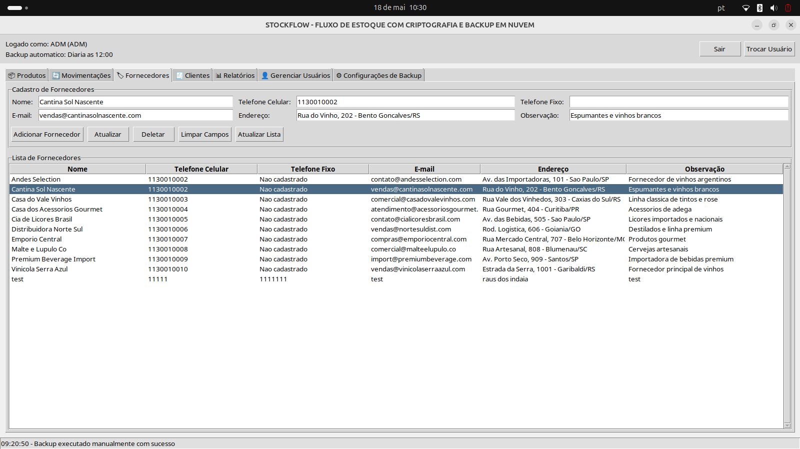
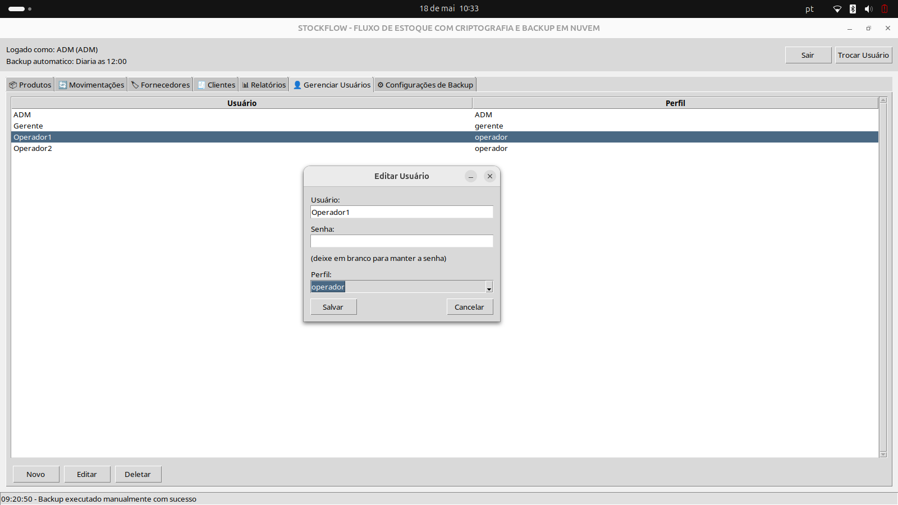
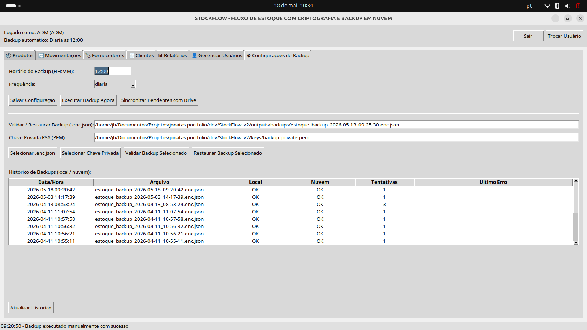
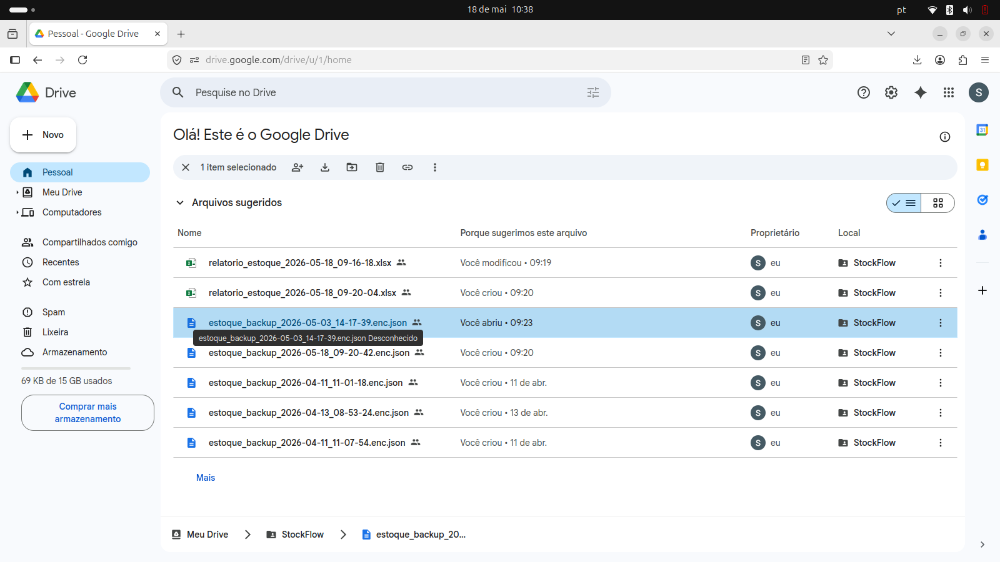
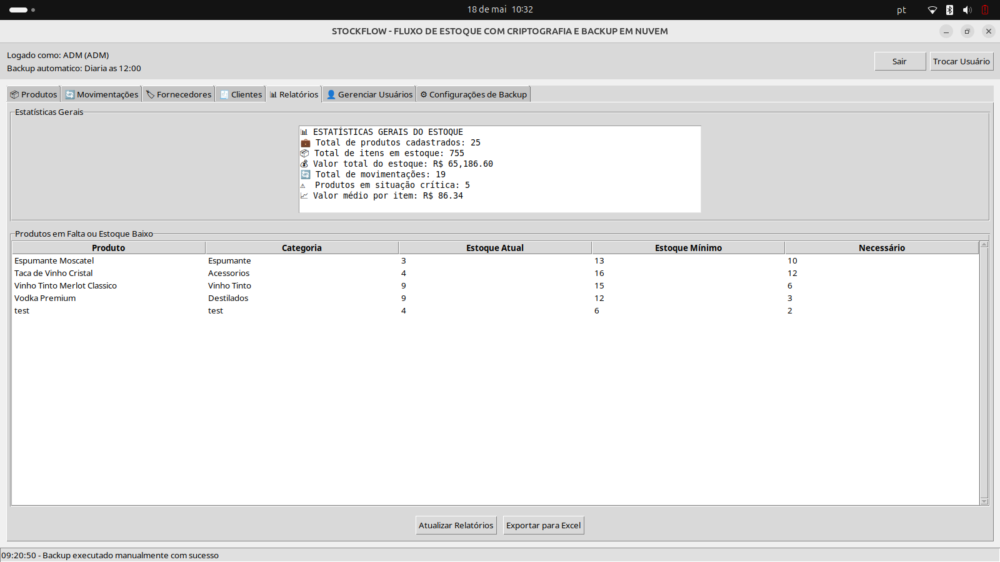
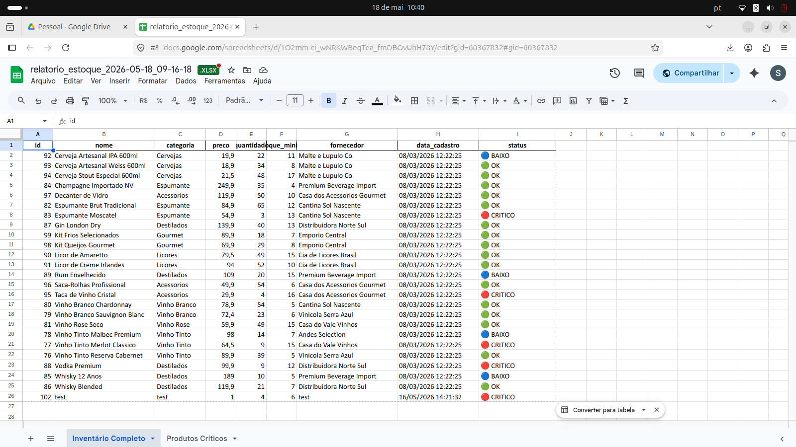

# StockFlow — Sistema de Gestão de Estoque com Backup Seguro

> **Um projeto de conclusão de curso que demonstra implementação profissional de segurança, persistência de dados e design de interface desktop.**

## O Projeto

StockFlow é um aplicativo desktop desenvolvido em **Python 3.12** que gerencia estoques com foco em **segurança de dados**. Implementa interface gráfica moderna com Tkinter, API relacional com SQLite, autenticação robusta com bcrypt e backup criptografado usando **envelope híbrido (AES-256-GCM + RSA-OAEP-SHA256)**.

**Valor técnico:** Este projeto demonstra capacidade de integrar múltiplas camadas de segurança, organizar código profissional e aplicar boas práticas em um sistema real.

## Arquitetura Técnica

| Camada | Tecnologia | Justificativa |
| :----: | :--------- | :------------ |
| **Frontend** | Tkinter | Interface nativa, portável (Linux/Windows/macOS), sem dependências externas |
| **Backend** | Python 3.12 | Linguagem versátil, excelente para prototipagem e produção |
| **Persistência** | SQLite + PRAGMA FK | Banco embarcado, transações ACID, integridade referencial |
| **Autenticação** | bcrypt | Hash adaptativo, protege contra força bruta e rainbow tables |
| **Criptografia** | AES-256-GCM + RSA-OAEP-SHA256 | Envelope híbrido: AES para volume, RSA para segurança da chave |
| **Offsite** | Google Drive API + OAuth 2.0 | Backup remoto automatizado com autenticação segura |

## Funcionalidades Principais

 **Gestão de Estoque**
- Cadastro, edição e consulta de produtos com múltiplos filtros
- Alertas automáticos para estoque mínimo
- Movimentações auditadas (entrada/saída com timestamp e usuário)

 **Segurança & Controle de Acesso**
- Autenticação com 3 perfis: ADM, Gerente, Operador
- Senhas armazenadas com bcrypt (não recuperáveis)
- Permissões granulares por tela/funcionalidade

 **Backup & Recuperação**
- Backup automático em horário configurável
- Criptografia com envelope híbrido (impossível descriptografar sem chave privada)
- Sincronização semi-automática com Google Drive
- Restauração com validação de integridade (SHA-256)

**Relatórios**
- Estatísticas gerais do sistema em tempo real
- Listagem de produtos em falta/estoque baixo
- Exportação para Excel com opção de upload em nuvem

## Competências Técnicas Demonstradas

### Engenharia de Software
- **Arquitetura em camadas:** CLI separada de GUI, lógica centralizada em backend
- **Padrões:** Factory, Observer (atualização de UI), Command (operações com desfazer)
- **Qualidade:** Tratamento robusto de exceções, logging estruturado, PRAGMA FK para integridade

### Segurança Criptográfica
- **Autenticação:** Implementação segura com bcrypt vs alternativas inseguras (MD5/SHA1)
- **Criptografia Simétrica:** AES-256-GCM para confidencialidade + autenticação
- **Criptografia Assimétrica:** RSA-OAEP-SHA256 para proteção de chaves (envelope híbrido)
- **Razão técnica:** AES é rápido para grandes volumes, RSA protege a chave — impossível descriptografar sem chave privada

### DevOps & Deployment
- **Automação:** Scripts Python para backup agendado, sincronização e restauração
- **Cloud Integration:** Google Drive API com OAuth 2.0 para armazenamento remoto
- **Versionamento & CI:** Preparado para Git, gitignore bem estruturado

### UI/UX
- **Tkinter Avançado:** Abas dinâmicas, Treeview com múltiplas colunas, filtros em tempo real
- **Acessibilidade:** Respeitando permissões, feedback claro com messagebox e status bar
- **Responsividade:** Threading para operações longas (backup) sem congelar UI

## Estrutura do Projeto

```
StockFlow_v2/
├── backend/
│   └── database.py           # EstoqueDB: CRUD, autenticação, transações
├── frontend/
│   └── gui.py                # StockFlowGUI: Tkinter, 7 abas, permissões
├── scripts/
│   ├── backup_offsite.py     # Criptografia, envelope & Google Drive
│   └── gerar_dados_demo.py   # Dados de teste para demo
├── tests/
│   └── test_core_functions.py # Testes unitários
├── outputs/
│   ├── backups/              # Backups criptografados (.enc.json)
│   ├── logs/
│   └── reports/
├── keys/                      # Chaves RSA (NÃO comitar chaves privadas)
├── estoque.db                 # SQLite local (NÃO comitar)
├── requirements.txt
├── TECNOLOGIAS_UTILIZADAS.txt # Documentação técnica completa
└── README.md
```

**Detalhe importante:** `.gitignore` protege credenciais, chaves privadas e dados locais.

## Quick Start

### Instalação
```bash
# Clonar repositório
git clone https://github.com/jonatas-pimenta/StockFlow_v2.git
cd StockFlow_v2

# Criar virtualenv (recomendado)
python3.12 -m venv .venv
source .venv/bin/activate  # Linux/macOS
# ou: .venv\Scripts\activate  # Windows

# Instalar dependências
pip install -r requirements.txt
```

### Executar
```bash
# Gerar dados de demonstração
python scripts/gerar_dados_demo.py

# Iniciar GUI
python frontend/gui.py
```

**Credenciais padrão (demo):**
- Usuário: `ADM` | Senha: `123qwe` (Administrador)
- Usuário: `Operador1` | Senha: `123qwe` (Operador)

---

## Demonstração Técnica

As imagens a seguir mostram as principais telas/abas da aplicação e o que é possível fazer em cada uma.

### Produtos
<p align="center">
  
</p>

Nesta aba o usuário faz o controle principal do estoque:

- Cadastrar novos produtos com nome, categoria, preço, quantidade, estoque mínimo e fornecedor
- Consultar a lista completa de itens em uma tabela com busca e seleção rápida
- Editar ou remover produtos já cadastrados
- Visualizar o status do item no estoque, ajudando a identificar produtos em baixa

### Movimentação
<p align="center">
  
</p>

Essa aba registra a entrada e a saída de mercadorias:

- Registrar movimentações de entrada e saída de estoque
- Selecionar o produto, a quantidade, o tipo da operação e a observação
- Associar a ação ao usuário logado para manter histórico de auditoria
- Consultar o histórico de movimentações já realizadas

### Clientes
<p align="center">
  
</p>

Nesta aba o sistema centraliza o cadastro de clientes:

- Cadastrar clientes com nome, telefones, e-mail, endereço e observação
- Editar ou excluir registros existentes
- Listar os contatos em uma tabela organizada para consulta rápida

Essa tela é útil para manter a base de clientes da empresa organizada e pronta para contato.

### Fornecedores
<p align="center">
  
</p>

Funcionalidades desta aba:

- Cadastrar fornecedores com dados de contato e endereço
- Atualizar ou excluir fornecedores já cadastrados
- Manter a relação entre produto e fornecedor para facilitar reposição e compras

### Gerenciar Usuários
<p align="center">
  
</p>

Permite administrar os acessos ao sistema:

- Criar contas com perfis ADM, gerente e operador
- Editar usuário, perfil e senha com armazenamento seguro via `bcrypt`
- Excluir ou desativar contas conforme a permissão do usuário logado
- Organizar o controle de acesso por nível de responsabilidade

### Configurações de Backup
<p align="center">
  
</p>

Essa aba fica disponível para o perfil administrador e concentra a rotina de proteção dos dados:

- Definir horário e frequência dos backups
- Executar backup manual imediatamente
- Sincronizar pendências com o Drive
- Validar e restaurar backups criptografados com chave privada RSA
- Consultar o histórico de backups local e em nuvem

### Lista de Backups / Restauração
<p align="center">
  
</p>

Nesta parte o sistema mostra os arquivos de backup e permite recuperação segura:

- Visualizar backups criptografados disponíveis em `.enc.json`
- Identificar data, status local e status na nuvem
- Restaurar o banco de dados a partir do backup selecionado
- Acompanhar tentativas de envio e possíveis erros no histórico

### Relatórios
<p align="center">
  
</p>

Também há o relatório de estoque específico:
<p align="center">
  
</p>

Recursos de relatórios:

- Exibir estatísticas gerais do sistema
- Listar produtos com estoque baixo ou em falta
- Atualizar os relatórios manualmente quando necessário
- Exportar os dados para planilha local e também enviar para a nuvem

## Por Que Este Projeto?

**Para Recrutadores:** Este projeto ilustra:

1. **Pensamento em Segurança**: Não apenas "criptografa dados", mas implementa envelope híbrido pensado — AES para velocidade, RSA para segurança. Bcrypt vs. SHA1 não é coincidência.

2. **Organização Profissional**: Backend separado de UI, permissões bem estruturadas, logging, tratamento de exceções.

3. **Full-Stack**: Desde design de banco, API de autenticação, até UI responsiva e backup automatizado.

4. **Documentação**: Código comentado, `TECNOLOGIAS_UTILIZADAS.txt` explicando *por quê* cada decisão, não só *o quê*.

---

## Referência Técnica Completa

 Veja [TECNOLOGIAS_UTILIZADAS.txt](TECNOLOGIAS_UTILIZADAS.txt) para:
- Comparação AES-128 vs AES-192 vs AES-256
- Por que bcrypt vs alternativas inseguras
- Explicação visual do envelope criptográfico
- Decisões arquiteturais justificadas

---

## Troubleshooting

**P: "invalid_grant" ao fazer backup para Drive?**
R: Token expirou. Delete `token_google_drive.json` e reautentique.

## Segurança Antes de Publicar no GitHub

Antes de subir este projeto, confirme que estes arquivos ficam somente na sua máquina e não entram no commit:

- `credentials.json`
- `credentials_oauth.json`
- `token_google_drive.json`
- `config_backup.json` se ele guardar dados locais ou URLs internos
- `keys/*.pem`, `keys/*.key` e qualquer chave privada
- `.venv/`
- `*.db` e `*.sqlite` se houver banco local gerado em produção

Se precisar compartilhar a configuração com outras pessoas, crie exemplos sem segredo, por exemplo `credentials.example.json` ou `config_backup.example.json`, e deixe os arquivos reais fora do repositório.

**P: "AES-GCM InvalidTag" na restauração?**
R: Chave privada incorreta ou arquivo corrompido. Verifique SHA-256 do ciphertext.

**P: "database is locked"?**
R: Feche a app, execute backup ou use `sqlite3 estoque.db "PRAGMA wal_checkpoint(TRUNCATE)"`.

**P: Como gero chaves RSA?**
R: Veja `keys/` — use `openssl genrsa -out private_key.pem 2048` e extraia pública com `openssl rsa -in private_key.pem -pubout -out public_key.pem`.

---

## Desenvolvimento & Contribuição

- **Testes**: `python -m pytest tests/test_core_functions.py`
- **Linting**: `flake8 . --ignore=E501,W503`
- **Type Checking**: `mypy backend/ frontend/ scripts/`

Para sugestões ou bugs, abra uma Issue no repositório.

---
<div align="center">
 
Estudante de Redes de Computadores | Aprendizado contínuo através de projetos práticos 

[](https://www.linkedin.com/in/jonatas-pimenta-9ab861288/)
[](https://github.com/jonatas-pimenta)

</div>