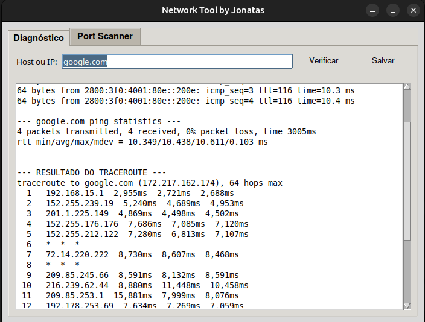

# 🌐 Network Tool GUI

<div align="center">


**Interface gráfica para ferramentas de rede e diagnóstico de conectividade**

[🚀 Instalação](#-instalação) • [💼 Funcionalidades](#-funcionalidades) • [🎯 Demo](#-demonstração) • [💼 Para Recrutadores](#-valor-para-recrutadores)

</div>

---

## 📋 Descrição do Projeto

O Network Tool GUI é uma aplicação desktop desenvolvida em Python que centraliza ferramentas essenciais de diagnóstico de rede em uma interface gráfica amigável. O projeto oferece uma alternativa visual moderna para comandos tradicionais de terminal, permitindo que profissionais de TI e estudantes realizem diagnósticos de rede de forma mais intuitiva e eficiente.

Este sistema é ideal para administradores de rede, técnicos em TI e estudantes que precisam de uma ferramenta visual para diagnóstico rápido de conectividade, sem a necessidade de memorizar comandos complexos de terminal.

---

## 🎬 Demonstração

### Interface Principal
<p align="center">
  
</p>

### Exemplo de Uso - Scanner de Portas
<p align="center">
  
</p>

---

## 🚀 Habilidades Técnicas Aplicadas

**Interface Gráfica e UX**
- Interface Tkinter nativa e responsiva
- Design intuitivo com abas organizadas
- Feedback visual em tempo real
- Validação de entrada automática

**Programação de Rede**
- Implementação de scanner de portas TCP
- Comandos de diagnóstico (ping, traceroute, nslookup)
- Processamento assíncrono para não travar interface
- Tratamento de timeouts e falhas de rede

**Arquitetura de Software**
- Programação Orientada a Objetos
- Separação de responsabilidades (frontend/backend)
- Threading para operações de rede
- Modularização clara do código

---

## 💼 Funcionalidades

### Ferramentas de Diagnóstico
- **Ping** - Teste de conectividade com hosts remotos
- **Traceroute** - Rastreamento de rota de pacotes
- **Nslookup** - Resolução de nomes DNS
- **Whois** - Informações sobre domínios registrados

### Scanner de Portas Avançado
- **Varredura TCP** - Detecção de portas abertas
- **Varredura por Intervalos** - Ex: 80-443, 20-25
- **Portas Comuns** - Presets para HTTP, FTP, SSH, etc.
- **Resultados Detalhados** - Status e serviços identificados

### Interface Intuitiva
- **Abas Organizadas** - Separação clara de funcionalidades
- **Validação em Tempo Real** - Verificação de IPs e domínios
- **Progresso Visual** - Indicadores de status das operações
- **Histórico** - Registro das consultas realizadas

---

## 📋 Pré-requisitos

- **Python 3.8+** (testado em 3.12)
- **Sistema Operacional:** Linux/macOS *(Windows com ajustes)*
- **Dependências:** Tkinter (incluído no Python padrão)
- **Ferramentas de Sistema:** ping, traceroute, nslookup, whois

---

## 🚀 Instalação

### Instalação Automática (Recomendada)
```bash
git clone https://github.com/jonatas-pimenta/jonatas-portfolio.git
cd dev/network-tool-gui
python3 app.py
```

### Verificar Dependências
```bash
# Verificar se as ferramentas estão instaladas
which ping traceroute nslookup whois

# Instalar se necessário (Ubuntu/Debian)
sudo apt update
sudo apt install iputils-ping traceroute dnsutils whois
```

---

## 💻 Como Usar

### Execução da Aplicação
```bash
python3 app.py
```

### Workflow Típico
1. **Abra a aplicação** - Interface com abas organizadas
2. **Escolha a ferramenta** - Ping, Traceroute, Scanner, etc.
3. **Digite o alvo** - IP ou domínio no campo apropriado
4. **Execute** - Clique no botão correspondente
5. **Analise resultados** - Saída formatada na área de texto

### Exemplos Práticos
```bash
# Ping para teste de conectividade
Target: google.com
Resultado: Tempo de resposta e estatísticas

# Scanner de portas
Target: 192.168.1.1
Portas: 80,443,22,21
Resultado: Status de cada porta
```

---

## 📁 Estrutura do Projeto

```
network-tool-gui/
├── app.py                       # Interface principal Tkinter
├── backend.py                   # Comandos de rede e processamento
├── scanner.py                   # Scanner de portas TCP
├── screenshots/                 # Capturas de tela
│   ├── interface_principal.png
│   ├── scanner_portas.png
│   └── ping_resultado.png
└── README.md                    # Documentação
```

---

## 🔧 Exemplos de Uso

### Teste de Conectividade
```python
# Via interface gráfica
Target: 8.8.8.8
Command: Ping
Result: Conectividade OK - 4ms avg
```

### Scanner de Portas
```python
# Varredura de rede local
Target: 192.168.1.0/24
Ports: 22,80,443
Result: Dispositivos ativos encontrados
```

---

## 🔍 Conceitos Aplicados

### **Programação GUI Desktop**
- Desenvolvimento de interfaces com Tkinter
- Gerenciamento de eventos e callbacks
- Layout responsivo com grid e pack
- Integração de widgets complexos

### **Programação de Rede**
- Sockets TCP para scanner de portas
- Subprocess para comandos do sistema
- Threading para operações assíncronas
- Tratamento de timeouts e exceptions

### **Engenharia de Software**
- Arquitetura MVC (Model-View-Controller)
- Separação clara de responsabilidades
- Código modular e reutilizável
- Documentação técnica abrangente

---

## 💼 Valor para Recrutadores

### Competências Demonstradas
- **Desenvolvimento GUI** - Interface Tkinter profissional e intuitiva
- **Programação de Rede** - Implementação de protocolos e diagnósticos
- **Arquitetura de Software** - Código bem estruturado e modular
- **Threading e Async** - Operações não-bloqueantes
- **Integração de Sistemas** - Combinação de GUI com ferramentas CLI
- **UX/UI Design** - Interface amigável para usuários técnicos

### Aplicabilidade Profissional
- **Administração de Redes** - Ferramenta para diagnóstico diário
- **Suporte Técnico** - Interface amigável para análise rápida
- **Segurança de Rede** - Scanner de portas para auditoria
- **Monitoramento** - Base para sistemas de monitoramento
- **Educação Técnica** - Ferramenta didática para ensino de redes

### Casos de Uso Reais
- Diagnóstico de problemas de conectividade
- Auditoria de segurança em redes locais
- Mapeamento de dispositivos em subnet
- Verificação de serviços ativos
- Troubleshooting de DNS e routing

---

## 🤝 Contato e Portfólio

<div align="center">

**Desenvolvido por [Jonatas Pimenta](https://github.com/jonatas-pimenta)**  
Estudante de Redes de Computadores | Buscando oportunidades de estágio em Tecnologia  

[](https://www.linkedin.com/in/jonatas-pimenta-9ab861288/)
[](https://github.com/jonatas-pimenta)

🎯 Este projeto demonstra habilidades em desenvolvimento GUI, programação de rede e arquitetura de software.

</div>
