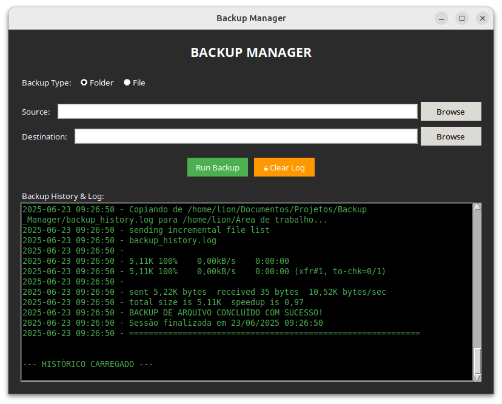

git clone https://github.com/jonatas-pimenta/jonatas-portfolio.git
# Backup Manager – Automação de Backups em Linux

Aplicação profissional para Linux que combina interface gráfica em Python (Tkinter) com engine de backup em Bash utilizando rsync. O projeto oferece backup de arquivos e pastas com histórico persistente, execução segura e operação responsiva.

## Arquitetura Implementada

O sistema adota uma arquitetura híbrida Python + Bash para combinar usabilidade (GUI) com eficiência e controle (rsync e shell script).

<p align="center">
  
</p>

| Componente | Detalhe Técnico | Função Principal |
| :--- | :--- | :--- |
| **Interface (GUI)** | Python 3.6+ com Tkinter | Seleção de origem/destino, escolha de modo, visualização de log |
| **Engine de Backup** | Bash (backup_engine.sh) + rsync | Execução de backups de pastas e arquivos |
| **Sincronização** | rsync com flags -avh | Cópia eficiente e incremental |
| **Concorrência** | Threading na GUI | Evita travamento da interface durante a execução |
| **Persistência de Logs** | backup_history.log | Histórico contínuo entre sessões |
| **Segurança Operacional** | Lock files + validações | Previne concorrência e destinos inválidos |

## Principais Funcionalidades

**Interface Gráfica e Usabilidade**
- Seleção visual de arquivos ou pastas para backup
- Escolha de modo (arquivo via rsync direto, pasta via engine Bash)
- Log em tempo real na interface durante a execução
- Histórico visual carregado ao iniciar a aplicação

**Engine de Backup Inteligente**
- rsync otimizado para arquivos individuais
- Script Bash dedicado para pastas com maior controle
- Proteção contra concorrência por lock file
- Validação de caminhos de origem e destino

**Sistema de Auditoria**
- Histórico contínuo em backup_history.log
- Timestamps precisos e status de cada operação
- Log visual com opção de limpeza protegida por senha

**Recursos Avançados**
- Threading assíncrono mantendo a GUI responsiva
- Feedback imediato de erros e progresso
- Persistência do histórico entre sessões
- Tratamento robusto de exceções na GUI e na engine

## Aplicação Profissional / Valor para Empresas

Backups confiáveis são críticos em operações de TI. Este projeto demonstra uma solução de automação de backup com interface amigável, adequada para equipes que precisam combinar usabilidade e robustez operacional.

Valores empresariais entregues:
- Reduz risco de perda de dados com execução confiável e auditável
- Aumenta produtividade: um clique executa backup com logs persistentes
- Facilita compliance: histórico detalhado para auditoria
- Opera em Linux nativo usando ferramentas padrão (rsync, bash)
- Separação clara de responsabilidades (GUI vs engine) para manutenção simples

## Competências Técnicas Demonstradas

- **Python GUI (Tkinter):** Interface desktop responsiva com threading
- **Bash e rsync:** Automação de cópia incremental e confiável
- **DevOps/Infra:** Controle de concorrência, validação de paths, lock files
- **Logging e Auditoria:** Histórico persistente e feedback em tempo real
- **Integração Python + Shell:** Orquestração multi-linguagem via subprocess
- **Tratamento de Erros:** Gestão de exceções na GUI e no shell script
- **Segurança Operacional:** Proteção de limpeza de logs por senha
- **Arquitetura Desktop:** Design modular separando UI e engine

## 📁 Estrutura do Projeto

```
backup-manager/
├── backup_gui.py           # Interface gráfica principal (Python/Tkinter)
├── backup_engine.sh        # Engine Bash/rsync para pastas
├── backup_history.log      # Histórico persistente de operações
├── requirements.txt        # Dependências Python
├── config.json             # Configurações opcionais
├── screenshots/
│   ├── interface-main.png
│   └── backup-progress.png
└── README.md
```

## 🔧 Demonstração Técnica

### Seleção Automática de Engine (GUI)
```python
# backup_gui.py - Escolha entre rsync e engine Bash
def execute_backup(self):
    if self.backup_type.get() == "arquivo":
        cmd = ["rsync", "-avh", "--progress", source, dest]
    else:
        cmd = ["./backup_engine.sh", source, dest]
    self.run_backup_thread(cmd)  # Executa em thread separada
```

### Logging Estruturado (Shell)
```bash
# backup_engine.sh - Registro persistente
{
    echo "========================================="
    echo "BACKUP $(date '+%d/%m/%Y %H:%M:%S')"
    echo "Origem: $SOURCE"
    echo "Destino: $DEST"
    echo "Status: $STATUS"
    echo "========================================="
} >> "$LOG_FILE"
```

### Threading para Interface Responsiva
```python
import threading

def run_backup_thread(self, cmd):
    thread = threading.Thread(target=self._execute_backup, args=(cmd,))
    thread.daemon = True
    thread.start()
```

## 💡 Desafios e Soluções (Troubleshooting)

**Desafio 1: Concorrência e Lock Files**
- Problema: Execuções simultâneas corrompiam o estado do log e do destino.
- Solução: Implementação de lock file na engine Bash para garantir execução única.

**Desafio 2: Interface Travando em Backups Grandes**
- Problema: Operações longas bloqueavam a GUI.
- Solução: Execução em thread separada e atualização do log por callbacks.

**Desafio 3: Validação de Caminhos de Origem/Destino**
- Problema: Usuários selecionavam destinos inválidos ou a própria origem.
- Solução: Validação pré-execução na GUI e no shell com mensagens claras.

**Desafio 4: Persistência de Histórico Entre Sessões**
- Problema: Log visual se perdia ao fechar a aplicação.
- Solução: Histórico persistente em backup_history.log com recarga automática na abertura.

## ⚡ Como Executar

### Preparação do Ambiente
```bash
git clone https://github.com/jonatas-pimenta/jonatas-portfolio.git
cd devops/backup-manager
python3 -m venv venv && source venv/bin/activate
pip install -r requirements.txt
chmod +x backup_engine.sh
```

### Execução
```bash
python3 backup_gui.py
```

### Uso Rápido
1. Escolha o tipo: Arquivo ou Pasta.
2. Selecione origem e destino.
3. Clique em "Run Backup" e acompanhe o log em tempo real.
4. Consulte o histórico persistente em backup_history.log.

### Verificações (opcional)
```bash
python3 -c "import tkinter; print('Tkinter OK')"
rsync --version
bash --version
```

---

<div align="center">
 
Estudante de Redes de Computadores | Aprendizado contínuo através de projetos práticos 

[](https://www.linkedin.com/in/jonatas-pimenta-9ab861288/)
[](https://github.com/jonatas-pimenta)

</div>