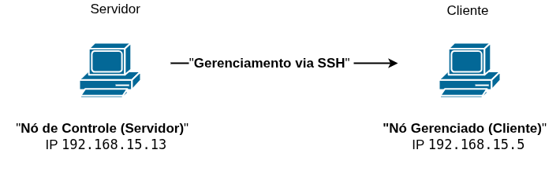
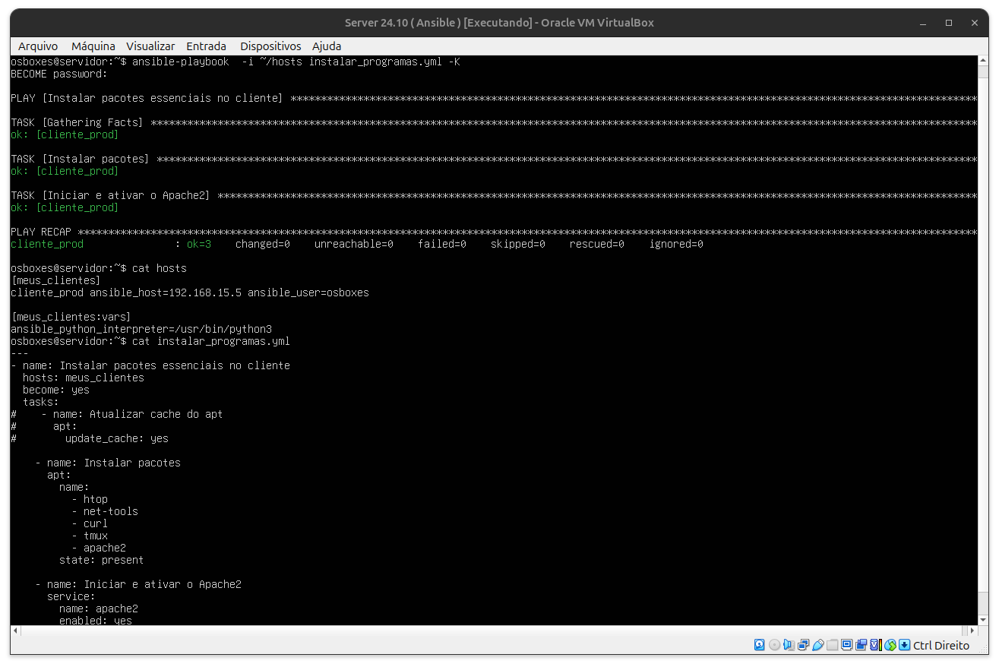

# 🤖 Laboratório Ansible

<div align="center">


**Laboratório prático de automação com Ansible - Gerenciamento de pacotes e serviços**

[🚀 Instalação](#-instalação) • [💼 Funcionalidades](#-funcionalidades) • [🎯 Demo](#-demonstração-em-vídeo) • [💼 Para Recrutadores](#-valor-para-recrutadores)

</div>

---

## 📋 Descrição do Projeto

Este é um laboratório prático de Ansible implementado para automatizar a instalação e configuração de pacotes essenciais em servidores Linux. O projeto demonstra conceitos fundamentais de automação de infraestrutura, utilizando um ambiente real com servidor de controle e cliente gerenciado via SSH.

O laboratório implementa um cenário real de gerenciamento de configuração, onde um servidor Ansible (nó de controle) automatiza a instalação de ferramentas essenciais em um cliente remoto, incluindo servidor web Apache2.

---

## 🎬 Demonstração em Vídeo

<div align="center">

<a href="https://drive.google.com/file/d/1sDR4jyO6Z-klkKrw6IW96EMYbydWNcSH/view?usp=drive_link" target="_blank">
  
</a>

<p style="margin-top: 12px;">
💡 <em>Veja o Ansible em ação — automação real funcionando.</em>
</p>

</div>

**O que você verá no vídeo:**
- Execução completa do playbook Ansible
- Instalação automatizada de pacotes
- Configuração do servidor Apache2
- Validação dos resultados em tempo real
- Arquitetura do laboratório explicada

---

## 🏗️ Arquitetura do Laboratório

<p align="center">
  
</p>


**Comunicação:** Gerenciamento via SSH com autenticação por chave

---

## 🚀 Resultado da Execução

<p align="center">
  
</p>

**Resultado demonstrado:**
- ✅ 3 tarefas executadas com sucesso
- ✅ 0 falhas ou erros
- ✅ Instalação e ativação do Apache2 completa
- ✅ Idempotência confirmada (changed=0)

---

## 🚀 Implementação Atual

### Arquivo de Inventário (`hosts`)
```ini
[meus_clientes]
cliente_prod ansible_host=192.168.15.5 ansible_user=osboxes

[meus_clientes:vars]
ansible_python_interpreter=/usr/bin/python3
```

### Playbook Principal (`instalar_programas.yml`)
```yaml
- name: Instalar pacotes essenciais no cliente
  hosts: meus_clientes
  become: yes
  tasks:
    - name: Atualizar cache do apt
      apt:
        update_cache: yes

    - name: Instalar pacotes
      apt:
        name:
          - htop
          - net-tools
          - curl
          - tmux
          - apache2
        state: present

    - name: Iniciar e ativar o Apache2
      service:
        name: apache2
        state: started
        enabled: yes
```

---

## 💼 Funcionalidades Implementadas

### Gerenciamento de Pacotes
- **Atualização automática** - Cache do apt sempre atualizado
- **Instalação de ferramentas** - htop, net-tools, curl, tmux
- **Servidor Web** - Apache2 instalado e configurado
- **Idempotência** - Execuções repetidas não causam problemas

### Gerenciamento de Serviços
- **Inicialização automática** - Apache2 ativo no boot
- **Status de serviço** - Verificação se serviços estão rodando
- **Configuração persistente** - Mudanças mantidas após reinicialização

### Recursos Utilizados
- **Módulo apt** - Gerenciamento de pacotes Debian/Ubuntu
- **Módulo service** - Controle de serviços systemd
- **Privilege escalation** - Uso de `become: yes` para sudo
- **Inventário estruturado** - Organização de hosts e variáveis

---

## 📋 Pré-requisitos

- **Ansible** instalado no servidor de controle
- **SSH** configurado entre servidor e cliente
- **Python 3** nos hosts gerenciados
- **Sudo** configurado para o usuário Ansible
- **Sistema:** Ubuntu/Debian (testado com apt)

---

## 🚀 Como Reproduzir

### 1. Configurar Ambiente
```bash
# No servidor de controle
sudo apt update
sudo apt install ansible

# Configurar SSH sem senha
ssh-keygen
ssh-copy-id osboxes@192.168.15.5
```

### 2. Criar Arquivos
```bash
# Criar inventário
cat > hosts << EOF
[meus_clientes]
cliente_prod ansible_host=192.168.15.5 ansible_user=osboxes

[meus_clientes:vars]
ansible_python_interpreter=/usr/bin/python3
EOF

# Criar playbook (conforme código mostrado acima)
```

### 3. Executar Automação
```bash
# Testar conectividade
ansible -i hosts meus_clientes -m ping

# Executar playbook
ansible-playbook -i hosts instalar_programas.yml -K
```

---

## 📁 Estrutura Real do Projeto

```
laboratorio-ansible/
├── hosts                        # Inventário de hosts
├── instalar_programas.yml       # Playbook principal
├── resultado-playbook.png       # Screenshot da execução
├── diagrama-arquitetura.png     # Diagrama da infraestrutura
└── README.md                    # Esta documentação
```

---

## 🔍 Conceitos Demonstrados

### **Automação de Infraestrutura**
- Gerenciamento de configuração via código
- Execução remota de comandos via SSH
- Idempotência nas operações
- Estruturação de inventários

### **Administração Linux**
- Gerenciamento de pacotes apt
- Controle de serviços systemd
- Configuração de usuários e permissões
- Automatização de tarefas administrativas

### **DevOps Básico**
- Infrastructure as Code conceitual
- Documentação de processos
- Versionamento de configurações
- Reprodutibilidade de ambiente

---

## 💼 Valor para Recrutadores

### Competências Demonstradas
- **Ansible Fundamentals** - Playbooks, inventários e módulos básicos
- **Linux System Administration** - Gerenciamento de pacotes e serviços
- **SSH e Networking** - Configuração de acesso remoto seguro
- **YAML** - Estruturação de arquivos de configuração
- **Troubleshooting** - Execução e validação de automações
- **Documentação** - Registro claro de processos e resultados

### Aplicabilidade Profissional
- **Automação de Servidores** - Base para ambientes maiores
- **Padronização** - Instalação consistente de ferramentas
- **Economia de Tempo** - Substituição de tarefas manuais
- **Fundação DevOps** - Primeiro passo para IaC mais complexo

### Evolução Possível
- Expansão para múltiplos hosts
- Implementação de roles reutilizáveis
- Integração com CI/CD
- Gerenciamento de configurações mais complexas

---

<div align="center">
 
Estudante de Redes de Computadores | Aprendizado contínuo através de projetos práticos 

[](https://www.linkedin.com/in/jonatas-pimenta-9ab861288/)
[](https://github.com/jonatas-pimenta)

</div>

