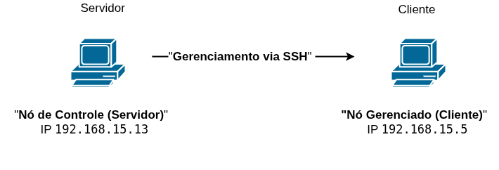
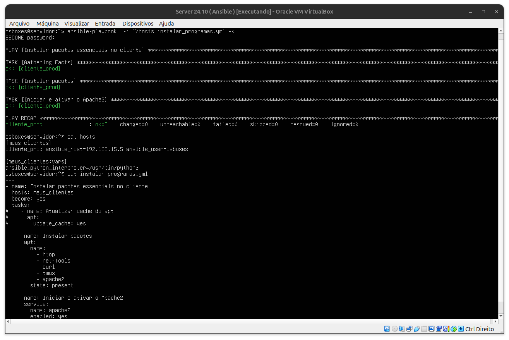

# 🤖 Laboratório de Automação com Ansible

<div align="center">


**Automação de infraestrutura usando Ansible e princípios de IaC**

[🚀 Instalação](#-como-usar) • [🏗️ Arquitetura](#-arquitetura-do-laboratório) • [📸 Demo](#-demonstração) • [💼 Para Recrutadores](./PARA_RECRUTADORES.md)

</div>

---

## 📋 Sobre o Projeto

Demonstração prática de automação de servidores Ubuntu usando Ansible e Infraestrutura como Código (IaC). O laboratório implementa um ambiente web padronizado e replicável através de um "Nó de Controle" que provisiona um "Nó Gerenciado".

---

## 🛠️ Tecnologias Utilizadas


---

## 💼 Funcionalidades

### ⚙️ **Automação de Infraestrutura**
- **📦 Gerenciamento de Pacotes** - Atualização automática do cache apt
- **🔧 Ferramentas Essenciais** - Instalação de htop, net-tools, curl, tmux
- **🌐 Servidor Web** - Provisionamento completo do Apache2
- **🔄 Idempotência** - Execuções múltiplas sem efeitos colaterais

### 🛡️ **Boas Práticas**
- **📝 IaC (Infrastructure as Code)** - Configuração versionada
- **🎯 Automação Declarativa** - Estado desejado via YAML
- **🔐 Acesso SSH** - Conectividade segura entre nós
- **📊 Inventário Estruturado** - Gestão organizada de hosts

---

## 🏗️ Arquitetura do Laboratório

<p align="center">
  
</p>

**Infraestrutura VirtualBox:**
- **🖥️ Nó de Controle (192.168.15.13)** - Servidor Ansible com playbooks
- **🎯 Nó Gerenciado (192.168.15.5)** - Cliente configurado remotamente via SSH

---

## 📋 Pré-requisitos

### Nó de Controle
- **🐧 SO:** Linux ou macOS *(Windows: usar WSL)*
- **⚙️ Software:** Ansible + Python 3.8+

### Nós Gerenciados  
- **🔐 Conectividade:** Acesso SSH configurado
- **🐍 Python:** Versão 2.7 ou 3.5+ para execução das tarefas

---

## 🚀 Como Usar

1. **Clone o repositório:**
   ```bash
   git clone [seu-repo] && cd laboratorio-ansible
   ```

2. **Configure o inventário:**
   ```bash
   # Ajuste o arquivo inventario.ini com IPs corretos
   nano inventario.ini
   ```

3. **Teste a conexão:**
   ```bash
   ansible meus_clientes -m ping
   ```
   *Saída esperada: resposta `SUCCESS` em verde*

4. **Execute o playbook:**
   ```bash
   ansible-playbook instalar_programas.yml
   ```

---

## 📁 Estrutura do Projeto

```
laboratorio-ansible/
├── instalar_programas.yml    # Playbook principal
├── inventario.ini           # Inventário de hosts
├── diagrama-arquitetura.png # Arquitetura visual
└── resultado-playbook.png   # Screenshot da execução
```

---

## 📸 Demonstração

<p align="center">
  
</p>


---

<details>
<summary><strong>💻 Código do Playbook (instalar_programas.yml)</strong></summary>

```yaml
---
- name: Instalar pacotes essenciais no cliente
  hosts: meus_clientes
  become: yes
  tasks:
    - name: Atualizar cache do apt
      apt:
        update_cache: yes

    - name: Instalar pacotes
      apt:
        name:
          - htop
          - net-tools
          - curl
          - tmux
          - apache2
        state: present

    - name: Iniciar e ativar o Apache2
      service:
        name: apache2
        enabled: yes
        state: started
```

</details>

---

## 🔗 Conecte-se Comigo

<div align="center">

[](https://www.linkedin.com/in/jonatas-pimenta-9ab861288/)
[](https://github.com/jonatas-pimenta)

</div>
